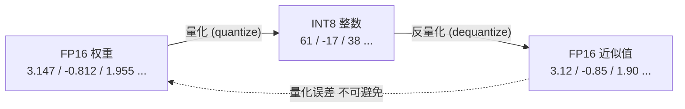

第 1 章我们算过一笔账：Decode 阶段是 Memory Bound，每生成一个 Token，都要把整个模型的权重从显存完整搬一遍。这笔账的另一面就是量化的机会——**如果权重用一半的比特存，搬运它的带宽开销就直接减半**。量化是推理优化里"性价比"最高的一招：不改模型结构、不改推理算法，只改数字的存储格式，就能换来显存和速度的双重收益。但天下没有免费的午餐，比特降下去，精度怎么保住，就是这一章要解决的核心矛盾。

本节先把地基打好：量化到底在做什么、scale 和 zero-point 怎么来的、对称和非对称怎么选、量化粒度有多粗有多细、scale 怎么校准出来、PTQ 和 QAT 两条路线怎么选。后面五节的所有方法——SmoothQuant、GPTQ、AWQ、KIVI、FP8——都是在这套基础框架上做文章。

<!-- more -->

## 📑 目录

- [1. 为什么量化：从 Memory Bound 说起](#1-为什么量化从-memory-bound-说起)
- [2. 量化的数学：scale 与 zero-point](#2-量化的数学scale-与-zero-point)
- [3. 对称量化 vs 非对称量化](#3-对称量化-vs-非对称量化)
- [4. 量化粒度：Per-tensor / Per-channel / Per-group](#4-量化粒度per-tensor--per-channel--per-group)
- [5. 校准：scale 怎么定](#5-校准scale-怎么定)
- [6. PTQ vs QAT：两条路线](#6-ptq-vs-qat两条路线)
- [7. 量化谁：Weight / Activation / KV Cache](#7-量化谁weight--activation--kv-cache)
- [总结](#-总结)
- [自我检验清单](#-自我检验清单)
- [参考资料](#-参考资料)

---

## 1. 为什么量化：从 Memory Bound 说起

### 1.1 三重收益

回到第 1 章的结论：Decode 阶段每步只处理 1 个 Token，矩阵乘法退化为矩阵-向量乘，GPU 的算力大量闲置，**瓶颈变成每步都要从显存读全部权重**。这个结论直接推出量化的三重收益：

- **省显存**：一个 7B 模型，FP16 存储要 14 GB；INT8 只要 7 GB；INT4 只要 3.5 GB。同样的卡能塞下更大的模型，或者给 KV Cache 留出更多空间（意味着更高并发）。
- **提速度**：Memory Bound 阶段的耗时近似正比于"搬运的字节数"。权重从 16 bit 降到 4 bit，读取时间接近降到 1/4——**在 Decode 这种访存受限的阶段，降比特几乎线性转化为提速**。
- **降成本**：显存减半意味着原本需要两张卡的模型现在一张就能跑，或者单卡能服务的并发翻倍，摊到每个请求的成本直接下降。

💡 **提示**：注意这个推理只对 Memory Bound 的 Decode 成立。Prefill 是 Compute Bound，瓶颈在算力而不是带宽，量化权重对 Prefill 的加速有限（INT8/FP8 若有硬件 Tensor Core 支持才能加速计算本身，见 4.5 节）。所以评估量化收益时，一定要分开看 TTFT（可能持平甚至变差）和 TPOT/吞吐（明显改善）。

### 1.2 量化的本质

一句话：**量化 = 用更少的比特、离散的格点去近似连续的浮点数**。

FP16 有 16 位，能表示约 6 万个不同的值（加上指数分布的动态范围）；INT8 只有 256 个格点；INT4 只有 16 个格点。量化做的事情，是把原本连续分布的一堆浮点数，"吸附"到这些有限的格点上，存储时只存格点编号（整数），用的时候再"反量化"回浮点数参与计算。



用一个类比：量化像把一段**连续的光滑曲线**（浮点数值）画到**方格纸**（整数格点）上。格纸越密（比特越多），描出来的曲线越贴近原样；格纸越稀（比特越少），误差越大。量化算法的全部艺术，就是**在格点数固定的情况下，让画出来的曲线"失真最小"**——格点怎么摆（对称/非对称）、一张格纸画多大范围（量化粒度）、曲线往格纸上怎么映射（校准），都是这个艺术的分支。

---

## 2. 量化的数学：scale 与 zero-point

### 2.1 量化与反量化公式

最通用的量化公式（非对称形式）：

$$
q = \mathrm{clip}\left(\mathrm{round}\left(\frac{x}{s}\right) + z,\ q_{min},\ q_{max}\right)
$$

$$
\hat{x} = s \cdot (q - z)
$$

各项含义：

- $x$：原始浮点值（如 FP16 权重）
- $q$：量化后的整数，落在 $[q_{min}, q_{max}]$ 内（INT8 是 $[-128, 127]$，INT4 是 $[-8, 7]$）
- $s$：**缩放因子（scale）**，一个浮点数，决定一格格点对应多大的浮点区间——它是量化里最重要的参数
- $z$：**零点（zero-point）**，整数，表示浮点 0 对应的格点位置
- $\hat{x}$：反量化恢复的近似值，$\hat{x} \neq x$ 的差就是量化误差

用一段伪代码把这个过程写直白：

```python
import numpy as np

def quantize_asym(x, qmin=-128, qmax=127):
    # 1. 从数据范围推出 scale 和 zero-point
    x_min, x_max = x.min(), x.max()
    scale = (x_max - x_min) / (qmax - qmin)
    zero_point = round(qmin - x_min / scale)          # 让 x_min 映射到 qmin
    # 2. 量化：除以 scale、加零点、四舍五入、截断
    q = np.clip(np.round(x / scale) + zero_point, qmin, qmax)
    return q.astype(np.int8), scale, zero_point

def dequantize(q, scale, zero_point):
    return scale * (q.astype(np.float32) - zero_point)
```

### 2.2 误差的两个来源

反量化回来的 $\hat{x}$ 和原值 $x$ 的差，来自两处：

- **舍入误差（round）**：$\mathrm{round}$ 把值吸附到最近格点，单个误差最多半个格距（$s/2$）。比特越少、$s$ 越大，这项越严重——这是 INT4 比 INT8 难做的根本原因。
- **截断误差（clip）**：如果 $x$ 的范围里有极端离群值（outlier），scale 会被撑得很大，导致**其余 99% 的普通值全部挤在少数几个格点里**，精度崩塌；若硬截断离群值，误差又直接表现为信息丢失。

📌 **关键点**：**离群值（Outlier）是量化精度杀手**。一个 100 倍于中位数的离群值，能把整个 tensor 的 scale 撑大 100 倍，让所有正常值的精度跟着陪葬。后面 4.2 节 SmoothQuant 的全部故事，以及 FP8 用指数位对抗离群值的设计（4.5 节），都是围绕这一点展开的。

---

## 3. 对称量化 vs 非对称量化

### 3.1 两种形式

**对称量化**：令 $z = 0$，浮点 0 严格对应整数 0，数值范围两边对称。

$$
s = \frac{\max(|x|)}{127}, \qquad q = \mathrm{clip}\left(\mathrm{round}\left(\frac{x}{s}\right), -128, 127\right)
$$

**非对称量化**：保留独立的 $z$，浮点区间 $[x_{min}, x_{max}]$ 被完整铺到 $[q_{min}, q_{max}]$，允许分布整体偏移。

| 📊 维度 | 对称量化 | 非对称量化 |
|---|---|---|
| 零点 $z$ | 恒为 0 | 独立可调 |
| 适用分布 | 大致关于 0 对称 | 明显偏态（如全为正） |
| 典型对象 | **Weight**（通常零均值对称） | **Activation**（如 ReLU/GELU 后非负、带离群值） |
| 计算开销 | 更简单（反量化少一次减法） | 略多（要减 $z$） |
| 格点利用率 | 偏态分布下浪费一半格点 | 分布再歪也能铺满 |

### 3.2 为什么 Weight 常用对称、Activation 常用非对称

训练良好的权重通常近似零均值的高斯分布，对称量化几乎不浪费格点，所以 **INT4 Weight-only 方案（GPTQ/AWQ）默认对称量化**。而 Activation 经过 GELU、Softmax 等非线性后分布五花八门：有的恒正、有的长尾偏斜，非对称量化能充分利用格点。这个"默认搭配"在后面几节会反复出现。

💡 **提示**：对称量化还有个隐性好处——反量化 $\hat{x} = s \cdot q$ 只是乘法，GPU 上可以和后面的 GEMM 融合成一个操作（把 $s$ 乘到结果上），这让"边算边反量化"的高性能 Kernel（如 Marlin，见 4.3 节）实现更简单。

---

## 4. 量化粒度：Per-tensor / Per-channel / Per-group

scale 只有一个数，但它管多大范围的数据？这就是**量化粒度（Quantization Granularity）**问题。范围越小（粒度越细），scale 越贴合局部分布，精度越好——但存储 scale 的额外开销也越多。

| 🏷️ 粒度 | scale 数量 | 精度 | scale 额外开销 | 典型用途 |
|---|---|---|---|---|
| **Per-tensor** | 整个矩阵 1 个 | 最差（被全局 outlier 拖累） | 可忽略 | W8A8、FP8 per-tensor scaling |
| **Per-channel** | 每个输出通道 1 个（Weight 按行） | 较好 | Weight 的 1/n（n 为通道数，约 0.05%~0.4%） | W8A8、SmoothQuant |
| **Per-group** | 每 group_size 个连续权重 1 个（如 128） | 最好 | 见下方计算 | **INT4 weight-only 标配** |
| Per-token | 每个输入 token 1 个（Activation 专用） | 较好 | 运行时动态计算，不占存储 | W8A8 的 Activation 侧 |

### 算一笔 group scale 的开销账

以 INT4、`group_size=128`、scale 用 FP16 存、对称量化（不存 zero-point）为例：

- 每 128 个权重（每个 4 bit，共 512 bit）多存一个 FP16 scale（16 bit）
- 额外开销 = 16 / (128 × 4) = **3.125%**

所以一个"7B INT4 模型"实际占用不是 3.5 GB 而是约 3.6 GB。group_size 越小精度越好、开销越大：`group_size=32` 时开销升到 12.5%。**128 是业界反复权衡后的甜点值**，GPTQ/AWQ 的开源模型几乎都是 `group_size=128, sym=True`。

📌 **关键点**：粒度本质上是在回答"**一个 scale 被多少个离群值绑架**"。Per-tensor 时整个矩阵的精度被全局最大值绑架；Per-group=128 时最多被 128 个数里的最大值绑架，即便某组里真有离群值，危害也被圈死在组内。这也是 INT4 敢把粒度做到 group 级的原因——比特少了，就得用粒度补回来。

⚠️ **注意**：Weight 侧的 Per-channel/Per-group 是**静态**的（权重不变，scale 离线算好存下来）。Activation 侧没有"固定权重"可依，只能要么 per-tensor 动态统计，要么 per-token（每行算 scale，见 4.2 节），粒度天然比 Weight 侧粗——这也是 Activation 比 Weight 难量化的原因之一。

---

## 5. 校准：scale 怎么定

PTQ（训练后量化）不训练、不改权重，scale 完全由**校准（Calibration）**决定：拿几百条有代表性的数据跑一遍模型，统计每层 Activation 的分布，再按某种策略算出 scale。常见策略从简单到复杂：

- **Min-Max**：直接取观测到的最小/最大值。问题是**一条数据里的一个离群值就会绑架 scale**，通常只在分布干净时可用。
- **Percentile**：截掉两头各 0.1%（或可调比例）的极端值再取范围，牺牲个别离群值换全体精度。最常用的"傻瓜但好用"方案。
- **MSE**：网格搜索一个截断阈值，让**量化前后数值的均方误差**最小。把"截多少"变成显式优化问题。
- **Entropy / KL 散度**（TensorRT 的经典方案）：搜索截断点，让量化后的分布和原分布的 KL 散度最小——衡量的不是数值误差，而是**信息量损失**，对最终任务效果往往更贴合。

💡 **提示**：校准数据的选择比校准算法本身更影响最终精度。**校准集要和真实业务输入同分布**：代码助手就用真实代码，多轮对话产品就带上真实对话历史。用一个通用语料校准、上线跑垂直领域任务，精度翻车的案例比比皆是——这在 4.6 节的"常见坑"里还会强调。

---

## 6. PTQ vs QAT：两条路线

### 6.1 两条路线是什么

- **PTQ（Post-Training Quantization，训练后量化）**：模型训练完直接量化。喂几百条校准数据，几分钟出结果，**不需要训练资源和原始训练数据**。LLM 时代的主流——没人愿意（也没条件）重新微调一个 70B 模型。本章讲的所有方法（SmoothQuant、GPTQ、AWQ、FP8 PTQ）都是 PTQ。
- **QAT（Quantization-Aware Training，量化感知训练）**：训练（或微调）过程中就插入"伪量化"节点——前向传播里模拟量化-反量化的舍入误差，让模型在训练时就**学会适应量化后的精度损失**。精度上限最高，但需要训练资源、数据和流程改造。

| 📊 维度 | PTQ | QAT |
|---|---|---|
| 需要的数据 | 几百条校准样本 | 完整训练/微调数据集 |
| 需要的算力 | 几分钟，单卡 | 正常训练量级，多卡 |
| 精度（INT8） | 通常接近无损 | 接近无损 |
| 精度（INT4） | 需要 GPTQ/AWQ 等专门算法 | 最好，但 PTQ 已够用 |
| 流程侵入性 | 零（不动原模型） | 高（要改训练代码） |
| LLM 生态主流度 | ✅ 绝对主流 | 少量场景（如 LLM-QAT、Gemma 的 QAT 版本） |

### 6.2 为什么 LLM 时代 PTQ 赢了

传统 CV 小模型时代 QAT 是常规操作——模型小，训练一遍不贵。但 LLM 改变了成本结构：重训/微调一个基座模型动辄几十万 GPU 时，而 PTQ 在 INT8 上几乎免费获得无损结果、在 INT4 上靠 GPTQ/AWQ 也能逼近 QAT 的精度。**当 PTQ 的精度够用时，QAT 的额外成本就不值得付**。QAT 在 LLM 上仍有一席之地的场景：极低比特（如 W4A4）追求极致、或对精度有苛刻要求且拥有训练管线的团队。

---

## 7. 量化谁：Weight / Activation / KV Cache

推理时显存里住着三样东西，对应的量化方案命名法是 **W{weight比特}A{activation比特}**：

- **Weight（权重）**：静态、不变，离线量化最友好。`W8A16` / `W4A16` 即 weight-only 方案。
- **Activation（激活值）**：每步都变、带离群值，量化难度最高。`W8A8` 表示权重和激活都量化成 8 bit——收益是 Prefill/Decode 的 GEMM 都能用低比特算力（配合硬件 Tensor Core 时接近 2 倍速度）。
- **KV Cache**：随序列长度线性膨胀，是长上下文场景的显存大头（第 1 章的账本公式里把 bytes 从 2 降到 1，整笔账直接减半）。它独立于 W/A 量化，可以单独启用。

三者的**难度是递增的**：Weight 静态可离线精雕（GPTQ/AWQ）；Activation 动态且被离群值折磨（SmoothQuant/FP8）；KV Cache 不仅动态，而且误差会**在层间和注意力计算中累积放大**（KIVI/FP8 KV）。这也是本章小节排列的内在逻辑。

📌 **关键点**：把本节的工具箱记住——**对称/非对称**（格点怎么摆）、**粒度**（一个 scale 管多宽）、**校准**（scale 怎么定）、**PTQ/QAT**（要不要让模型适应误差）、**量化对象**（W/A/KV 三选几）。后面五节的每一个方法，都能拆解成这套工具箱里几个旋钮的组合。

---

## 📝 总结

- 量化的动机由第 1 章 Memory Bound 的结论直接推出：**降比特 → 减显存、减带宽、提吞吐、降成本**，对 Decode 阶段收益尤其大。
- 量化的数学骨架是 $q = \mathrm{clip}(\mathrm{round}(x/s) + z)$，误差来自**舍入**和**截断**两处；**离群值是精度杀手**，它绑架 scale 的能力是后续所有故事的主线。
- **对称量化**（$z=0$）适合零均值对称的 Weight，**非对称量化**适合偏态的 Activation。
- 量化粒度从 **Per-tensor → Per-channel → Per-group** 越来越细：粒度越细，离群值的危害越被局部圈定；INT4 的标配是 `group_size=128`（scale 额外开销约 3.1%）。
- 校准策略（Min-Max / Percentile / MSE / KL）决定 scale；**校准数据与真实业务同分布**比算法选择更关键。
- LLM 时代 **PTQ 是绝对主流**（几百条数据、几分钟、不动原模型），QAT 只在极低比特或精度苛刻场景出现。
- 量化对象分 **Weight / Activation / KV Cache** 三类，难度依次递增，分别对应本章后续的 W4A16、W8A8 与 KV Cache 量化、FP8 各节。

## 🎯 自我检验清单

- 能从 Memory Bound 出发，推出量化对 Decode 速度和对 Prefill 速度的影响为什么不同
- 能写出量化和反量化公式，并指出 scale、zero-point、clip 各自的作用
- 能区分舍入误差和截断误差，并解释离群值如何"绑架" scale
- 能说出对称量化适合什么分布、为什么不存 zero-point 反而对 Kernel 融合有利
- 能计算 `group_size=128` 的 INT4 量化中 scale 带来的额外存储开销
- 能解释 Per-group 量化为什么能圈定离群值的危害
- 能列举四种校准策略，并说明校准集分布为什么重要
- 能对比 PTQ 和 QAT 的成本与精度，并解释为什么 LLM 生态选择了 PTQ
- 能解释 W4A16、W8A8 这类命名法的含义，以及 Weight/Activation/KV Cache 量化难度的排序原因

## 📚 参考资料

- [A Survey of Quantization Methods for Efficient Neural Network Inference（量化综述）](https://arxiv.org/abs/2103.13630)
- [8-bit Optimizers via Block-wise Quantization（含量化基础概念）](https://arxiv.org/abs/2110.02861)
- [Integer Quantization for Deep Learning Inference（NVIDIA 实践总结）](https://arxiv.org/abs/2004.09602)
- [NVIDIA TensorRT 文档 — Quantization（校准与 PTQ 工程实践）](https://docs.nvidia.com/deeplearning/tensorrt/latest-guide/quantization.html)
