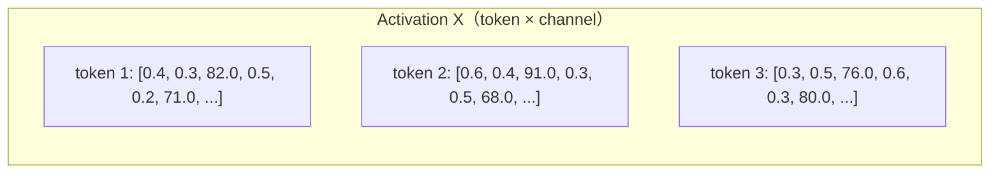
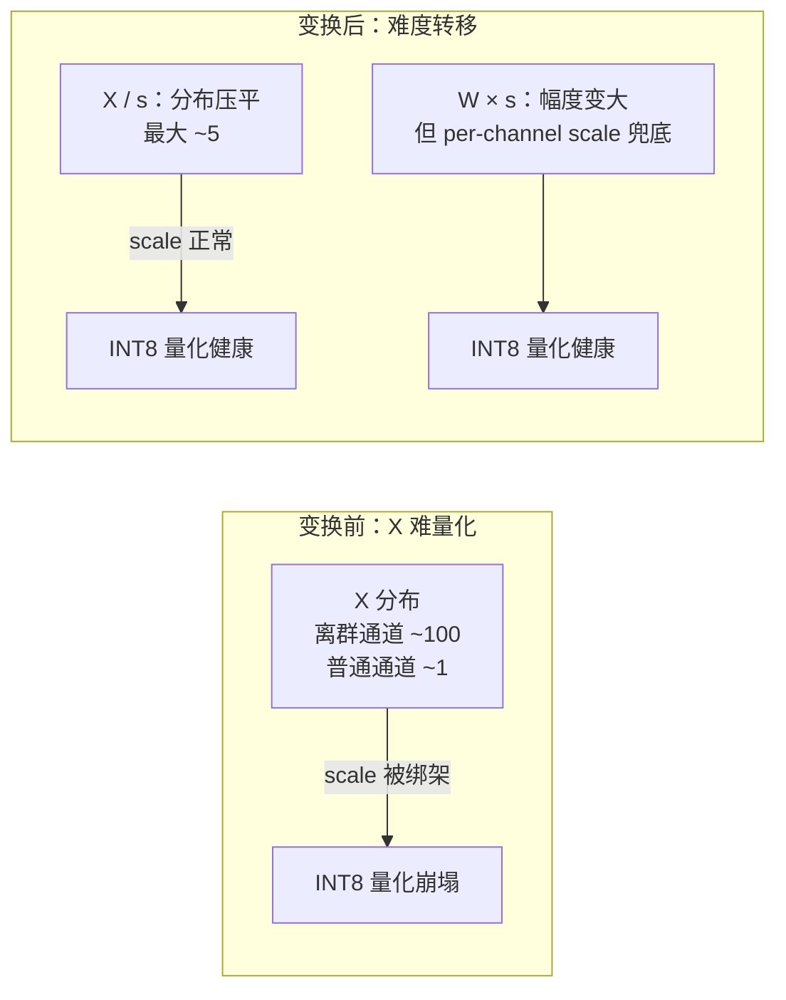

上一节的结尾埋了一个雷：**离群值是量化精度杀手**。对 Weight 来说，离群值问题不严重——权重的分布通常对称、没有极端值，INT8 甚至 INT4 都能做。真正的重灾区在 **Activation**：LLM 的激活值里存在系统性、持续性的离群通道，幅度可达普通值的 100 倍，直接把 per-tensor 的 scale 撑爆。这就是为什么"把 Weight 和 Activation 都量化成 INT8"（W8A8）这件事，在 LLM 上拖到 2022 年底都没人做对。

本节讲 W8A8 的完整故事：先看 LLM.int8() 怎么发现并"硬扛"这个问题（精度对、速度错），再看 SmoothQuant 怎么用一行数学等价变换优雅地化解它（精度对、速度也对）。这个"等价变换搬移难度"的思想，会在 4.3 节的 AWQ 里再出现一次——值得彻底吃透。

<!-- more -->

## 📑 目录

- [1. Activation Outlier：W8A8 的拦路虎](#1-activation-outlierw8a8-的拦路虎)
- [2. 先行者 LLM.int8()：混合精度的硬扛](#2-先行者-llmint8混合精度的硬扛)
- [3. SmoothQuant 核心思想：数学等价变换](#3-smoothquant-核心思想数学等价变换)
- [4. 迁移强度 α 与工程落地](#4-迁移强度-α-与工程落地)
- [5. 精度、性能与局限](#5-精度性能与局限)
- [总结](#-总结)
- [自我检验清单](#-自我检验清单)
- [参考资料](#-参考资料)

---

## 1. Activation Outlier：W8A8 的拦路虎

### 1.1 LLM.int8() 的发现

2022 年，Tim Dettmers 在 LLM.int8() 论文里系统描述了这个现象，要点有三：

- **规模触发**：模型小于约 6.7B 时激活分布基本正常；一旦超过这个规模（OPT-175B、BLOOM-176B、GLM-130B 等），离群值**必然出现**。
- **系统性**：离群值不是随机噪声——它们集中在**固定的少数通道（channel）**上，且同一通道在几乎所有 token、几乎所有层都保持巨大幅度。
- **极端幅度**：离群通道的绝对值可达普通通道的 50~100 倍，且随模型规模增大而更极端。

用一张示意图直观感受（每列是一个 channel，颜色深浅代表该 token 在该 channel 上的激活幅度）：

注意第 3、6 通道：**每一个 token 在这两个通道上都是巨大的**。它们不是"个别数据点的毛刺"，而是模型内在的、确定性的结构。

### 1.2 为什么这毁掉了朴素的 INT8 Activation 量化

套用上一节的公式。假设激活矩阵某层的取值范围由离群通道决定，比如 $[-100, 100]$，而普通通道都在 $[-1, 1]$ 之间：

- INT8 一共 256 个格点，per-tensor scale = $200 / 256 \approx 0.78$
- 普通通道的值（0.3、0.5 这种）四舍五入后全都吸附到 0 或 1 个格点上——**有效精度不到 1 bit**
- 整个矩阵 99% 的信息，被 1% 的离群通道谋杀

📌 **关键点**：问题的根源不是"离群值存在"，而是 **per-tensor 这个粒度让离群值能绑架所有人**。解法自然有两个方向：要么把离群值单独拎出来处理（LLM.int8() 的思路），要么想办法让数值分布变"平"（SmoothQuant 的思路）。

⚠️ **注意**：那为什么不直接对 Activation 用 per-channel 粒度？因为推理时 Activation 是**在线产生的**——GEMM 的输入 X 形状是 `(token数, in_features)`，它的 channel 维对应的是**下一个 Linear 的输入维度**。如果按 X 的每列（channel）配 scale，这些 scale 必须作用在 W 的**行**上，等价于把 per-channel 结构塞进 GEMM 的数据布局里，标准 INT8 GEMM Kernel 无法直接吃。这个约束正是下一节"等价变换"要正面解决的。

---

## 2. 先行者 LLM.int8()：混合精度的硬扛

LLM.int8() 的做法简单粗暴：**离群通道单独走 FP16 路径，其余走 INT8**。

把矩阵乘 $Y = XW$ 拆成两半：

$$
Y = \underbrace{X_{outlier} W_{outlier}}_{\text{FP16 精确计算}} + \underbrace{X_{normal} W_{normal}}_{\text{INT8 快速计算}}
$$

- 每次矩阵乘前，把含离群通道的列从 X 里切出来（约 0.1%~1% 的列），对应地从 W 里切出对应的行
- 小矩阵走 FP16 GEMM，大矩阵走 INT8 GEMM，结果相加
- 精度确实保住了——8 bit 下与 FP16 几乎无差

但代价是**速度**：一次 GEMM 变成"切分 + 两次 GEMM + 相加"，数据在 FP16/INT8 格式间反复搬运、转换，Kernel 无法高效融合。结果是 LLM.int8() 在很多场景下**比 FP16 推理还慢**——买得起精度，付不起速度。它证明了"W8A8 在大模型上可行"，但也证明了"硬扛离群值"这条路走不通。

💡 **提示**：LLM.int8() 的价值在于**把问题诊断清楚了**——离群值是系统性的、固定在特定 channel 上的。这个"固定"非常关键：既然离群通道可预测，我们就可以**离线地**针对它们做变换，而不必在推理时动态切分。SmoothQuant 正是抓住了这一点。

---

## 3. SmoothQuant 核心思想：数学等价变换

### 3.1 一个恒等式

SmoothQuant 的出发点是一行小学乘法：

$$
Y = XW = (X \cdot \mathrm{diag}(s)^{-1})(\mathrm{diag}(s) \cdot W)
$$

其中 $s \in \mathbb{R}^{n}_{>0}$ 是一个逐通道的缩放向量（$n$ 是 in_features 维度）。这个变换在数学上**严格等价**——只是把每个通道上的数值，在 X 和 W 之间重新分配了幅度：

- X 的第 $i$ 列除以 $s_i$ → 离群通道被"压平"
- W 的第 $i$ 行乘以 $s_i$ → 幅度等价地转移到权重侧

### 3.2 为什么把难度推给 Weight 是赚的

回忆上一节：**Weight 天生好量化**（静态、对称、无离群值），**Activation 天生难量化**（动态、离群值绑架 scale）。SmoothQuant 的洞察是：等价变换前，X 和 W 对量化精度的"耐受度"严重不对称——那为什么不让**容易的一方多扛一点**？

用数值例子走一遍。假设某个通道上：

- X 列的最大值是 100（离群），W 行的最大值是 0.3
- 取 $s_i = 20$：变换后 X 列最大值变为 5（压平了 20 倍），W 行最大值变为 6（放大 20 倍，仍在 INT8 舒适区）

对 X 来说，其它普通通道（最大值 ~1）除以各自的 $s$ 后依然 ~1，**离群通道与普通通道的差距从 100 倍压缩到几倍**——per-tensor scale 不再被绑架。对 W 来说，行被放大 20 倍也没关系：Weight 是静态的、per-channel 量化的（每个通道一个 scale），放大多少都被自己的 scale 归一化掉，**真正的代价只是让 W 的分布稍微不那么"整齐"**，而 W 的分布余量大得很。

🔑 **核心概念**：**SmoothQuant = 用数学等价变换，把量化难度从"难量化的一方"（Activation）搬到"好量化的一方"（Weight）。** 变换本身不改变任何计算结果，只改变数值的分布形态。

---

## 4. 迁移强度 α 与工程落地

### 4.1 平滑因子的设计

$s$ 怎么选？SmoothQuant 的答案是同时看 Activation 和 Weight 的分布，取几何风格折中：

$$
s_j = \frac{\max|X_j|^{\alpha}}{\max|W_j|^{1-\alpha}}
$$

- $\max|X_j|$：校准集上，第 $j$ 个通道激活绝对值的最大值（离群通道在这里体现出 100 倍的巨大 $s$）
- $\max|W_j|$：权重第 $j$ 行的最大值
- $\alpha \in [0, 1]$：**迁移强度**——离群值"往 Weight 搬多少"

两个极端：

- $\alpha = 0$：不做平滑，退化为朴素 per-channel 量化（离群值原样留着）
- $\alpha = 1$：完全迁移——把 X 的分布彻底压平到 1，代价是 W 的行被放大最多
- 论文推荐默认 $\alpha = 0.5$（几何平均），对大多数模型最优；离群值特别极端的模型（如 OPT-175B）用 $\alpha = 0.75$，即多搬一些给 Weight

### 4.2 落地细节：scale 融合，推理零开销

变换引入的 $\mathrm{diag}(s)$ 会不会带来额外计算？几乎不会，因为它可以被**融合进相邻层**：

- **W 侧**：$\mathrm{diag}(s) \cdot W$ 在**离线量化时一次性乘进权重**，推理时不存在这一步。
- **X 侧**：$X \cdot \mathrm{diag}(s)^{-1}$ 可以融合进**前一个算子**——若前一层是 LayerNorm/RMSNorm，乘进其输出 scale；若前一层是 Linear，乘进该 Linear 的输出端权重。Transformer 里每个 Linear 的输入侧几乎总能找到一个可融合的前驱。

📌 **关键点**：SmoothQuant 的推理路径 = **逐通道平滑后的标准 W8A8 GEMM**，没有 LLM.int8() 那种运行时矩阵切分和格式转换。这就是"零开销"的来源。

### 4.3 量化配置小结

SmoothQuant 论文最终采用的配置（也是后续 W8A8 方案的事实标准形态）：

- **Weight**：静态 per-channel（per-row，沿 input 维度）对称 INT8 量化
- **Activation**：**动态 per-token**（每个 token 一个 scale，运行时统计）对称 INT8 量化——平滑之后分布已经健康，per-token 动态统计开销很小且精度好
- **平滑因子 $s$**：校准集离线统计，$\alpha$ 默认 0.5
- **不量化的部分**：LayerNorm、Softmax 等非线性算子保持 FP16；首层和 lm_head 通常也保持高精度

---

## 5. 精度、性能与局限

### 5.1 效果

论文结果（OPT / BLOOM / LLaMA 系列验证）：

- **精度**：INT8 W8A8 与 FP16 相比，在多个任务上几乎无损（差距在噪声范围内）；而不用 SmoothQuant 的朴素 W8A8 在大模型上直接崩掉
- **速度**：相比 LLM.int8() 快 **1.5~1.7 倍**（消除了运行时切分），相比 FP16 在大 batch 时快最多约 1.6 倍（INT8 GEMM 的带宽与算力优势）

### 5.2 局限与边界

- **依赖校准质量**：$s$ 来自校准集，业务分布漂移大时平滑因子失配，精度可能下降。
- **离群值不止一种**：SmoothQuant 处理的是"Linear 输入侧的固定 channel 离群值"。Softmax 内部、残差流里的其它形态离群值它不负责；极端情况下需要配合 α 逐层搜索（后续工作如 OWQ 做了更细的逐层自适应）。
- **硬件绑定收益**：W8A8 的加速依赖硬件 INT8 Tensor Core（NVIDIA 从 Turing 起原生支持）。在 Hopper 及更新的卡上，**FP8 承担了 W8A8 的角色**（同样 8 bit，浮点格式天然抗离群值，连平滑都省了，见 4.5 节）。SmoothQuant 的思想则被 AWQ（4.3 节）继承到 INT4 weight-only 场景，活得比它自己的 INT8 场景更久。

💡 **提示**：在 vLLM 生态里，SmoothQuant 格式的模型可通过其量化检查点格式加载，但今天更常见的 W8A8 路线是 FP8（Hopper 上）——两者解决的是同一个问题，只是"抗离群值"的手段不同：SmoothQuant 用数学变换把分布压平，FP8 用指数位让格点自己适配大动态范围。

---

## 📝 总结

- Activation Outlier 是 LLM（约 >6.7B）的**系统性结构**：固定通道、持续存在、幅度可达普通值 100 倍，会绑架 per-tensor scale，谋杀其余通道的精度。
- **LLM.int8()** 用"离群通道走 FP16、其余走 INT8"的混合精度保住了精度，但运行时切分/拼接/格式转换让速度甚至不如 FP16。
- **SmoothQuant** 用恒等式 $Y = (X\,\mathrm{diag}(s)^{-1})(\mathrm{diag}(s)\,W)$ 把量化难度从 Activation 搬到 Weight：X 被压平、W 被放大但由 per-channel scale 兜底。
- 平滑因子 $s_j = \max|X_j|^{\alpha} / \max|W_j|^{1-\alpha}$，迁移强度 $\alpha$ 默认 0.5，离群值越极端 α 越大。
- $\mathrm{diag}(s)$ 通过**离线乘进权重 + 融合进前驱算子**实现推理零开销，落地形态是"per-channel Weight + per-token Activation"的标准 W8A8。
- 效果：INT8 几乎无损，比 LLM.int8() 快 1.5 倍以上；局限是依赖校准、只管 Linear 输入侧的 channel 离群值，且在 Hopper 后逐渐被 FP8 路线取代——但"等价变换搬移难度"的思想在 AWQ 中延续。

## 🎯 自我检验清单

- 能描述 Activation Outlier 的三个特征（规模触发、系统性、极端幅度）及其对 per-tensor 量化 scale 的影响
- 能解释为什么 LLM.int8() 精度对但速度差（切分、两次 GEMM、格式转换）
- 能写出 SmoothQuant 的等价变换式，并解释"为什么把难度推给 Weight 是赚的"
- 能说明平滑因子公式中 α 的物理含义，以及 α=0 / α=1 分别对应什么
- 能说出 $\mathrm{diag}(s)$ 在 X 侧和 W 侧分别如何被融合、为什么推理零开销
- 能描述 SmoothQuant 最终的量化配置（Weight per-channel、Activation per-token）
- 能对比 LLM.int8() 与 SmoothQuant 解决离群值问题的思路差异
- 能解释为什么在 Hopper 之后 FP8 取代 INT8 W8A8，以及 SmoothQuant 思想在 AWQ 里的延续

## 📚 参考资料

- [SmoothQuant: Accurate and Efficient Post-Training Quantization for Large Language Models（论文）](https://arxiv.org/abs/2211.10438)
- [LLM.int8(): 8-bit Matrix Multiplication for Transformers at Scale（Activation Outlier 的发现）](https://arxiv.org/abs/2208.07339)
- [SmoothQuant 官方仓库（MIT-Han-Lab）](https://github.com/mit-han-lab/smoothquant)
- [Outlier Suppression: 探测 Transformer 中离群值位置的后续工作](https://arxiv.org/abs/2209.13325)
