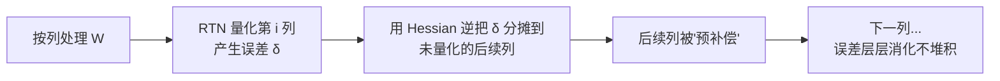

4.2 节的 W8A8 同时量化权重和激活，目标是让 GEMM 用 INT8 算力跑得更快。这一节换一条路：**只量化权重，激活保持 FP16**——即 W4A16 的 Weight-only 量化。它的动机来自第 1 章的另一个结论：Decode 阶段每步只算 1 个 Token，激活小得可怜，**访存的大头是权重本身**。既然瓶颈只在权重，那就只动权重——直接干到 INT4，把权重显存和读取带宽砍到 1/4。

但 INT4 只有 16 个格点，独立地把每个权重四舍五入（RTN）精度会明显掉。本节讲两大算法如何应对：**GPTQ** 用 Hessian 信息做误差补偿（量化一个权重时，让其余权重替它"还债"），**AWQ** 用激活分布找出"不能错"的关键通道并加以保护。最后讲 **Marlin Kernel**——没有它，INT4 反量化本身会成为新瓶颈，四比特就白省了。

<!-- more -->

## 📑 目录

- [1. 为什么 Weight-only：Decode 的账本](#1-为什么-weight-onlydecode-的账本)
- [2. 核心矛盾：INT4 太挤了](#2-核心矛盾int4-太挤了)
- [3. GPTQ：基于 Hessian 的误差补偿](#3-gptq基于-hessian-的误差补偿)
- [4. AWQ：激活感知的通道保护](#4-awq激活感知的通道保护)
- [5. GPTQ vs AWQ 怎么选](#5-gptq-vs-awq-怎么选)
- [6. Marlin Kernel：让反量化接近免费](#6-marlin-kernel让反量化接近免费)
- [7. 动手：量化一个模型](#7-动手量化一个模型)
- [总结](#-总结)
- [自我检验清单](#-自我检验清单)
- [参考资料](#-参考资料)

---

## 1. 为什么 Weight-only：Decode 的账本

先算账。Decode 每步的 GEMM 实际形状是：`(batch, 1, d_model) × (d_model, d_out)`——激活只有 batch 数那么几行，权重却是完整的一整张矩阵。搬一个权重元素的成本 × 参数量，就是这一步的访存量：

| 📊 项目 | FP16 | INT4 Weight-only |
|---|---|---|
| 7B 模型权重显存 | 14 GB | ~3.6 GB（含 group scale 开销） |
| 70B 模型权重显存 | 140 GB | ~36 GB |
| Decode 每步权重读取量 | 全量 2 字节/元素 | 全量 0.5 字节/元素 |
| 激活显存 | 不变（FP16） | 不变（FP16） |
| 单卡可跑性（80 GB 卡） | 70B 塞不下 | **70B 单卡可跑** |

📌 **关键点**：Weight-only 的收益逻辑是**纯访存逻辑**——激活本来就小，量化它收益有限还引入离群值麻烦（4.2 节），那就干脆不动它。省下的显存和带宽，直接改善 Memory Bound 的 Decode，同时解锁"消费级显卡跑大模型"的部署形态。

那 Prefill 呢？Prefill 是 Compute Bound，W4A16 下 GEMM 前还得先把 INT4 反量化成 FP16 才能进 Tensor Core（FP16 算力），所以 Prefill 不加速、甚至可能因为反量化略慢。W4A16 是为 **Decode 吞吐**优化的方案。

---

## 2. 核心矛盾：INT4 太挤了

INT4 对称量化一共 16 个格点：$\{-8, -7, \dots, 0, \dots, 7\}$。配合 `group_size=128`，每组 128 个权重共享一个 scale。最朴素的做法是 **RTN（Round-To-Nearest）**：每个权重独立四舍五入到最近格点。

问题在于误差的量级：组内最大值假设是 0.5，scale = 0.5/7 ≈ 0.07，每个权重的舍入误差最多半个格距 ≈ 0.036。**单独看一个权重，这点误差无所谓；但一个 7B 模型有 70 亿个这样的误差，层层累积，输出分布就会系统性偏离。** 实测中 RTN 在 W8 下勉强可用，在 W4 下 perplexity 明显上升、复杂推理任务显著掉分。

于是核心矛盾变成：**格点就 16 个，怎么摆布权重，才能让"整网络"的输出误差最小？** 两个算法给出两种哲学：

- **GPTQ：事后补救**——允许每个权重有误差，但量化完一个后立刻调整还没量化的权重，把误差抵消掉（误差补偿）
- **AWQ：事前保护**——发现约 1% 的通道特别重要，量化前先给它们"扩权"，让这些通道的权重在格点上更精确（缩放保护）

---

## 3. GPTQ：基于 Hessian 的误差补偿

### 3.1 思想来源：OBS 与"误差会传播"

GPTQ（2022）的思想可以追溯到经典的 OBD/OBS（Optimal Brain Surgeon）系列：**删掉/量化一个权重，对网络输出的影响不是孤立的**——其它权重可以联动调整来补偿。OBS 给出了理论最优解：量化某个权重时，其余权重的最优修正量与损失函数的 Hessian 矩阵相关。

直接对几十亿参数算 Hessian 逆不现实，GPTQ 做了一连串漂亮的工程近似：

### 3.2 逐列量化 + 误差分摊

把一个 Linear 层的权重矩阵 W 按列（一个列向量对应一个输入维度）逐列量化，对第 $i$ 列：

1. 用 RTN 量化这一列：$\hat{w}_i = Q(w_i)$，得到误差 $\delta_i = w_i - \hat{w}_i$
2. **把这个误差按 Hessian 加权分摊到后续未量化的列上**：$W_{[:, i+1:]} \mathrel{-}= \delta_i \cdot \frac{(H^{-1})_{[:, i]}}{(H^{-1})_{i,i}}$（$H$ 是该层输出对权重的二阶统计，可用 $2XX^T$ 近似——只需要校准数据的激活协方差）
3. 继续下一列，直到整层量化完成

直观理解：量化第 $i$ 列欠了债（误差），就**立刻调整还没量化的列来还债**。前面列的误差不会堆积到最后，而是被持续消化。配合贪心顺序（按激活幅度降序处理，重要的先量化、留给它更充足的补偿空间）和分块 Cholesky 逆的数值稳定实现，GPTQ 能在单卡上几小时内量化 175B 模型。



💡 **提示**：GPTQ 的校准只需要**激活统计**（算 $XX^T$），不需要反向传播、不需要 label，是纯 PTQ 流程。这也是它比 QAT 便宜几个数量级的原因。

---

## 4. AWQ：激活感知的通道保护

### 4.1 两个关键观察

AWQ（Activation-aware Weight Quantization，2023）从另一个角度切入，它有两个实证观察：

- **观察 1：权重不是同等重要的。** 每层约 0.1%~1% 的通道（由**激活幅度**界定的 salient channel）对量化误差极其敏感——这些通道对应的激活值很大，同样大小的权重误差会被放大传导。如果把它们弄坏，精度立刻崩。
- **观察 2：保护它们不需要混合精度。** 直觉做法是 salient 通道保留 FP16（混合精度），但这会破坏 Kernel 的规则性、拖慢速度。AWQ 发现存在纯量化的替代方案。

### 4.2 缩放保护：把 SmoothQuant 的变换反过来用

AWQ 的做法是给 salient 通道乘一个大于 1 的 scale，**在量化前拉大它的数值范围**：

$$
Y = XW = (X \cdot \mathrm{diag}(s))(\mathrm{diag}(s)^{-1} \cdot W)
$$

又是这个恒等式——但方向和 SmoothQuant 相反：这里把 X 的 salient 通道**放大** $s$ 倍（推理时融合进前一层），W 的对应行**缩小** $s$ 倍后参与量化。效果是：**被缩小的行虽然格点更"挤"了，但 salient 通道乘的是激活误差放大系数的逆，量化误差对输出的实际影响被压到最小**。更直白的解读：通过等价变换，把"重要性"从激活侧转译成"权重侧的量化精度分配"。

scale 不是拍脑袋定的：AWQ 对每层做**网格搜索**（$s = \max|X|^{\alpha}, \alpha \in [0, 1]$ 步进搜索），以量化后输出误差最小为目标，全程不需要反向传播。

📌 **关键点**：GPTQ 补偿的是"权重空间"的误差（Hessian 分摊），AWQ 保护的是"输出空间"的误差（激活感知缩放）。两者不互斥——事实上 AWQ 论文里也对比了"GPTQ + 混合精度"的组合，但纯缩放方案在工程规则性上胜出。

### 4.3 为什么 AWQ 泛化更好

GPTQ 的误差补偿是**对着校准集"精调"**的，Hessian 信息来自校准数据的分布——如果线上输入分布和校准集差异大（OOD），补偿可能失配，精度下滑。AWQ 只依赖"哪些通道激活大"这个**相对粗糙但稳定**的统计，对分布漂移不敏感。论文实测：在跨领域数据（校准用普通文本、评测用代码）上，AWQ 的精度波动明显小于 GPTQ。**部署环境输入分布复杂的业务，AWQ 是更稳的选择。**

---

## 5. GPTQ vs AWQ 怎么选

| 📊 维度 | GPTQ | AWQ |
|---|---|---|
| 核心思想 | Hessian 误差补偿（事后还债） | 激活感知缩放（事前保护） |
| 校准需求 | 激活统计 + 逐层误差反传 | 仅激活统计 + 网格搜索 |
| 校准速度 | 稍慢 | 快 |
| 同分布精度 | 两者接近，都很高 | 两者接近，都很高 |
| OOD / 跨领域泛化 | 相对更敏感 | **更稳健** |
| 生态 | GPTQModel / AutoGPTQ，历史 checkpoint 极多 | AutoAWQ，社区活跃 checkpoint 多 |
| vLLM 支持 | ✅（自动路由到 Marlin 等 Kernel） | ✅（自动路由到 Marlin 等 Kernel） |

实践中两者的精度差异通常在 0.1 PPL 量级，**选哪个更多看：有没有现成的、质量好的量化 checkpoint；线上输入分布是否可控**。4.6 节的选型决策会再回到这里。

---

## 6. Marlin Kernel：让反量化接近免费

### 6.1 没有专用 Kernel 会怎样

Weight-only 量化的朴素推理流程：

```text
读 INT4 权重 → 反量化成 FP16（全量转一遍）→ 存回显存 → FP16 GEMM
```

这个流程里，反量化要**先写一遍 FP16 中间结果到显存再读回来**——访存量从 0.5 字节/元素膨胀回 2 字节/元素，**INT4 的带宽收益被中间结果吃光**，整体可能比原生 FP16 还慢。

### 6.2 Marlin 的做法：反量化融合进 GEMM

Marlin（2024）的关键设计：**反量化发生在 GEMM Kernel 内部的寄存器/共享内存里**，不落显存：

- Kernel 从显存只读紧凑的 INT4 打包数据（权重读取量就是 0.5 字节/元素，**Memory Bound 的收益全额兑现**）
- 数据进入 shared memory / register 后，在喂给 Tensor Core（FP16 MMA）**之前**在线反量化成 FP16
- 通过精心的分块、流水线与指令调度，把反量化开销藏进 Tensor Core 计算的"阴影"里

实测效果：Marlin 在 batch 小（Decode 场景）时达到接近 FP16 GEMM 理论峰值的算力利用率——也就是说**反量化几乎免费**。这直接把 W4A16 从"省显存但可能不提速"变成"省显存且显著提速"。

💡 **提示**：vLLM 对 GPTQ/AWQ 格式的模型会**自动检测并启用 Marlin**（当满足条件：权重量化格式受支持、GPU 算力足够等），无需手动配置。如果部署 INT4 模型发现速度不如预期，第一件事就是确认 Kernel 是否真的落在 Marlin 上（日志会打印使用的 quant kernel）。此外还有专门面向大 batch（Prefill/大并发）场景的变体 Kernel（如 Machete、Moirai），Marlin 主打小 batch 优——细节随版本演进，以所用 vLLM 的 Kernel 路由逻辑为准。

---

## 7. 动手：量化一个模型

社区生态里最常用的两个工具链：

```bash
# AWQ 路线（AutoAWQ）
autoawq  # Python 包；或使用其 CLI/Python API
# Python 典型用法：
# from awq import AutoAWQForCausalLM
# model = AutoAWQForCausalLM.from_pretrained("Qwen/Qwen2.5-7B-Instruct")
# model.quantize(tokenizer, quant_config={
#     "w_bit": 4, "group_size": 128, "zero_point": True, "version": "GEMM"})
# model.save_quantized("./Qwen2.5-7B-Instruct-awq")

# GPTQ 路线（GPTQModel，AutoGPTQ 的后继）
# from gptqmodel import GPTQModel
# quant = GPTQModel.load("Qwen/Qwen2.5-7B-Instruct", quant_config={
#     "bits": 4, "group_size": 128, "sym": True})
# quant.quantize()
# quant.save("./Qwen2.5-7B-Instruct-gptq")
```

两个要点：

- **优先找现成 checkpoint**：主流模型（Llama、Qwen、Mistral 系）社区都有大量 `*-awq` / `*-gptq` 量化版，质量参差但省事；自己量化只在模型冷门或有定制校准需求时才必要。
- **校准集贴近业务**：接 4.1 节的结论——用业务真实样本（几百条即可）做校准，比默认通用语料更稳。

⚠️ **注意**：不同工具对 `zero_point`（sym/asym）和 `group_size` 的默认值不同。主流 Kernel（Marlin 及后续）对 `group_size=128`（以及 64/32 等 2 的幂次）支持最好；非标准配置可能出现"能加载但回落到慢速 Kernel"的隐性退化，量化前先查所用推理框架的支持列表。

---

## 📝 总结

- **Weight-only（W4A16）** 是纯访存逻辑的方案：Decode 瓶颈在权重读取，只量化权重就能把带宽和显存砍到 1/4，激活 FP16 不动、避开离群值问题；代价是 Prefill 不加速。
- INT4 只有 16 个格点，**RTN 精度不够**，两大算法从两种哲学解决：**GPTQ 事后补偿**（用 Hessian 逆把每列量化误差分摊给未量化列，层层消化）与 **AWQ 事前保护**（激活感知找出 salient 通道，用等价缩放保护，且对 OOD 更稳健）。
- AWQ 与 SmoothQuant 共享同一个数学变换 $Y=(X\,s)(s^{-1}W)$，但方向相反、目的不同——一个把难度从激活搬到权重（W8A8），一个把"重要性"从激活转译成权重的精度分配（W4A16）。
- **Marlin Kernel** 把反量化融进 GEMM 内部（shared memory/register 在线反量化），兑现 INT4 全部带宽收益，使 W4A16 真正"又省又快"；vLLM 自动路由，无需手动配置。
- 工程上：优先用现成量化 checkpoint，自己量化时保证校准集与业务同分布、`group_size` 走标准值（128）。

## 🎯 自我检验清单

- 能从 Decode 的访存账本推出 Weight-only 量化的收益来源，并解释为什么 W4A16 对 Prefill 无加速
- 能解释 RTN 在 INT4 下失效的原因（误差累积）
- 能描述 GPTQ 逐列量化 + Hessian 误差分摊的流程，以及它为什么只需要激活统计
- 能说出 AWQ 的两个关键观察，以及缩放保护相比混合精度的优势
- 能解释 AWQ 与 SmoothQuant 使用同一个等价变换却方向相反的原因
- 能对比 GPTQ 与 AWQ 在 OOD 场景下表现差异的成因
- 能解释朴素"反量化→GEMM"两步流程为什么吃掉 INT4 的带宽收益，以及 Marlin 如何解决
- 能列出自己动手量化模型时的两个关键注意事项（校准分布、group_size 标准化）

## 📚 参考资料

- [GPTQ: Accurate Post-Training Quantization for Generative Pre-trained Transformers（论文）](https://arxiv.org/abs/2210.17323)
- [AWQ: Activation-aware Weight Quantization for LLM Compression and Acceleration（论文）](https://arxiv.org/abs/2306.00978)
- [Marlin: Mixed-Precision Auto-Regressive Parallel Inference on GPUs（论文）](https://arxiv.org/abs/2408.11743)
- [AutoAWQ 官方仓库（casper-hansen）](https://github.com/casper-hansen/AutoAWQ)
- [GPTQModel 官方仓库（ModelCloud）](https://github.com/ModelCloud/GPTQModel)
- [vLLM — Quantization（GPTQ/AWQ 加载与 Kernel 路由）](https://docs.vllm.ai/en/latest/features/quantization/)
