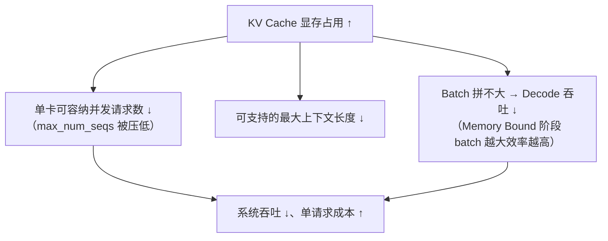
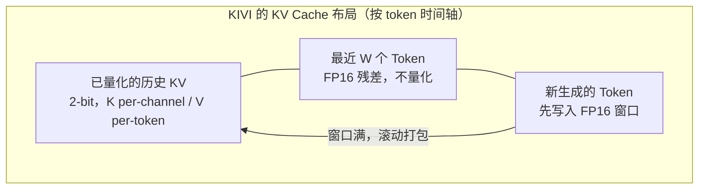

前面两节量化的都是"模型本体"——权重和激活。但第 1 章的显存账本提醒过我们：**随着上下文变长，KV Cache 会反超权重，成为显存第一大头**。一个 70B 模型、128K 上下文，单条请求的 KV Cache 就能吃掉几十 GB——PagedAttention 管的是"别浪费"，管不了"总量就是大"。这一节讲 KV Cache 量化：怎么把这笔账直接砍半（FP8）甚至砍到 1/8（2-bit），以及它和权重量化完全不同的坑——**量化误差会在 Attention 计算和层层堆叠中累积放大**。

<!-- more -->

## 📑 目录

- [1. 长上下文的显存瓶颈](#1-长上下文的显存瓶颈)
- [2. KV Cache 量化难在哪](#2-kv-cache-量化难在哪)
- [3. INT8 / FP8 KV Cache：第一档收益](#3-int8--fp8-kv-cache第一档收益)
- [4. KIVI：K/V 分治的 2-bit 方案](#4-kivikv-分治的-2-bit-方案)
- [5. 与其他技术的交互](#5-与其他技术的交互)
- [6. vLLM 实战：启用 KV Cache 量化](#6-vllm-实战启用-kv-cache-量化)
- [总结](#-总结)
- [自我检验清单](#-自我检验清单)
- [参考资料](#-参考资料)

---

## 1. 长上下文的显存瓶颈

### 1.1 复习账本公式

第 1 章给过单 Token 的 KV Cache 占用公式：

$$
\text{per\_token\_bytes} = 2 \times L \times H_{kv} \times d_{head} \times \text{bytes}
$$

其中 2 是 K 和 V 各一份、L 是层数、$H_{kv} \times d_{head}$ 是每层的 KV 总维度、bytes 是数据类型字节数。这个公式的关键特性是：**占用与序列长度线性增长，与并发数成正比**——权重是固定成本，KV Cache 是变动成本。

拿 Llama-3.1-70B（FP16，$L=80$，GQA $H_{kv}=8$，$d_{head}=128$）算一笔账：

- 单 Token：$2 \times 80 \times 8 \times 128 \times 2\,\text{B} = 320\,\text{KB}$
- 单条 128K 请求：$320\,\text{KB} \times 131072 = 40\,\text{GB}$
- **一条请求的 KV Cache ≈ 40 GB，比两整张 80 GB 卡的一半还多**

### 1.2 KV Cache 大的连锁反应

KV Cache 吃显存不只是"放不下"的问题，它直接压制所有关键指标：



📌 **关键点**：权重量化（W4A16）省下的显存，最终往往也会被 KV Cache 吃掉一部分——所以长上下文场景里，**权重量化和 KV Cache 量化是配套使用**的，两者分别作用于账本的不同行。而 KV Cache 量化最直接的好处：公式里的 bytes 从 2 降到 1（FP8/INT8）甚至 0.5（2-bit），**同一张卡能容纳的上下文总长度直接翻倍到四倍**。

---

## 2. KV Cache 量化难在哪

KV Cache 量化表面上和权重量化一样是"把 FP16 换成低比特"，但有三个独有的难点：

- **误差会累积**。权重是"一次量化、反复使用"，误差是静态的；KV Cache 是**每生成一个 Token 就新写入一批**，误差持续产生。更糟的是，每一步 Decode 的 Attention 都要读全部历史 KV——**旧的量化误差会在每一步被反复消费**，还会沿着层与层之间传播放大。一个 Token 的 K 量化歪了，后面每一步、每一层对它的 Attention 都会歪一点。
- **K 和 V 的分布形态不同**。实测发现：Key 在固定 channel 上有系统性离群值（和 4.2 节 Activation Outlier 同源——K 本身就是激活的产物），**按 channel 看差异巨大**；Value 则相对平滑，但**不同 token 之间幅度波动大**。一个方案吃遍 K 和 V 基本不可能，得分开下药。
- **精度要求更高**。权重量化掉 0.1% 的精度，输出可能只是用词风格略变；KV Cache 误差直接影响的是 **Attention 的检索能力**——大海捞针任务里，一个数值的偏差可能让模型"捞错针"。长上下文能力是新模型的招牌卖点，KV Cache 量化必须在这个最敏感的任务上不掉链子。

💡 **提示**：为什么 K 的离群值在 channel 维、V 的差异在 token 维？可以从 Attention 的计算结构理解：QK^T 里 K 的每个 channel 参与的是和 Q 的点积——某些 channel 对所有 token 都贡献大（位置编码等信号集中在特定维度）；而 V 是被 Attention 权重加权求和后直接进残差流的，其幅度分布更取决于内容本身，随 token 变化。

---

## 3. INT8 / FP8 KV Cache：第一档收益

### 3.1 朴素方案的直接收益

最简单的做法：对 K、V 用和权重一样的量化套路（per-token 或 per-channel 的 INT8/FP8），显存账本立刻减半：

| 📊 方案 | bytes/元素 | 相对显存 | 精度 |
|---|---|---|---|
| FP16 KV（基线） | 2 | 1× | — |
| INT8 KV | 1 | 0.5× | 多数任务接近无损，长上下文任务需验证 |
| **FP8 KV（E4M3）** | 1 | 0.5× | **通常几乎无损**（浮点动态范围兜底） |
| KIVI 2-bit | 0.5 + 少量 FP16 残差 | ~0.3× | 论文报告接近 FP16（见下节） |

### 3.2 为什么 FP8 是现在的默认选择

在 Hopper 及之后的卡上，**FP8 KV Cache 是无脑甜点**：E4M3 的指数位天然覆盖离群值（4.5 节详述），基本不需要精心设计校准；PagedAttention 的 Kernel 侧直接支持从 FP8 格式的块里读取；显存收益和 INT8 相同、精度更好。vLLM 中一条参数即可启用（第 6 节）。

INT8 KV Cache 则是 Hopper 之前（Ampere 等）的选项，且更依赖校准质量——需要为每层的 K、V 统计合适的 scale，通常由框架在加载时从校准数据或检查点里取。

---

## 4. KIVI：K/V 分治的 2-bit 方案

如果 8-bit 还不够省（超长上下文、超高并发场景），就要往 2-bit 走。直接把 4.1 节的量化公式套上去会精度崩塌——2-bit 对称量化只有 4 个格点 $\{-2, -1, 0, 1\}$（或非对称 4 格）。KIVI（2024）的关键贡献是**顺着 K 和 V 的分布形态，各选各的量化维度，再补一个精妙的残差设计**。

### 4.1 三个设计

- **K 按 channel 量化**。K 的离群值集中在固定 channel——那就每个 channel 一个 scale（channel 维度上分组），离群 channel 被自己的 scale 归一化，不绑架别人。量化后的 K 存储布局天然是"channel 连续"的，对 `QK^T` 的 Kernel 也友好。
- **V 按 token 量化**。V 的幅度波动在 token 维——那就每个 token 一个 scale，每个 token 的 V 行内部分布相对均匀。
- **保留近期 Token 的 FP16 残差**。这是最精妙的一笔：Attention 权重通常集中在**最近的上下文**（局部性），最近几个 Token 的 KV 误差对输出影响最大。KIVI 把最近若干 Token 的 K、V **保留为 FP16 不量化**，只量化"久远"的部分；窗口内的 token 随生成滚动，写满一个窗口才整体打包量化一次。



### 4.2 效果

论文结果：Llama-2-70B / Llama-3-8B 等模型上，**2-bit KV Cache 的困惑度与下游任务接近 FP16 基线**，显存降到约 1/8，长上下文场景吞吐提升数倍（能塞的 batch 大了）。工程上 KIVI 需要推理框架实现对应的打包 Kernel 与窗口管理，生态支持不如 FP8 普及——目前主要在专门优化超长上下文/高并发的部署里出现。

⚠️ **注意**：2-bit 是激进档位。上线前务必用**你自己的长上下文任务**（大海捞针、长文档 QA、RULER 之类）做回归验证——不同模型、不同任务对 KV 误差的敏感度差异很大，论文数字不能代替自己的测试。

---

## 5. 与其他技术的交互

KV Cache 量化不是孤立的开关，它和推理引擎里其它机制有真实的化学反应，部署前要过一遍：

- **Prefix Cache / 共享前缀**（2.3 节）：量化的 KV 块会被前缀缓存复用，**一个块的量化误差影响所有命中它的请求**。好处是量化 KV 的复用还能省去重复量化计算；风险是误差影响面变大，精度验证更要严格。
- **Chunked Prefill**（2.4 节）：分块写入 KV 时，per-token/per-channel scale 的统计边界要跨 chunk 一致，否则块与块之间的 scale 跳变会引入额外误差——这属于框架实现质量，选型时留意相关 issue。
- **投机解码**（第 5 章）：投机解码会对 draft token 反复"写入再回滚" KV，量化 KV 的写入路径必须支持高频回滚；两者的兼容性依赖框架实现，同时开启前查文档确认。
- **权重量化叠加**：W4A16 权重 + FP8 KV 是常见组合（显存两手抓），一般独立作用、互不干扰，但要分别验证精度。

📌 **关键点**：KV Cache 量化的精度评估一定要在**长上下文 + 高并发的真实负载**下做，只跑短 prompt 的 PPL 会严重高估它的安全性——误差累积效应恰恰在长序列上才显形。

---

## 6. vLLM 实战：启用 KV Cache 量化

vLLM 中通过 `--kv-cache-dtype` 一行启用：

```bash
# 启动服务时使用 FP8 KV Cache（Hopper 及以上推荐）
vllm serve meta-llama/Llama-3.1-8B-Instruct \
    --kv-cache-dtype fp8_e4m3

# 离线推理等价写法
# from vllm import LLM
# llm = LLM(model="meta-llama/Llama-3.1-8B-Instruct",
#           kv_cache_dtype="fp8_e4m3")
```

几个工程要点：

- `fp8_e4m3` 与 `fp8_e5m2` 对应两种 FP8 格式（4.5 节详述差异），KV Cache 场景默认选 **E4M3**（精度优先）。
- 启用后观察启动日志里的 KV Cache 块数：**同样的 `gpu_memory_utilization`，块池可用块数大约翻倍**——这就是上下文容量/并发上限的直接来源。
- KV Cache dtype 与模型权重量化格式（GPTQ/AWQ/FP8 checkpoint）**独立配置**，可以任意组合，如 `--quantization awq_marlin` + `--kv-cache-dtype fp8_e4m3`。
- 精度回归：启用前后各跑一遍长上下文评测（如 128K 大海捞针、长文档摘要对比），确认质量没有可感知退化，再全量切流。

💡 **提示**：什么时候该开 KV Cache 量化？一个简单判据——启动日志或监控里如果 **KV Cache 占用的显存接近甚至超过权重**（长上下文、多轮对话、高并发场景很容易出现），就是明确的开启信号；反之短 prompt、低并发的服务收益有限，可以先不开、省掉一次精度验证的成本。

---

## 📝 总结

- 长上下文场景下 **KV Cache 反超权重成为显存第一大头**（70B/128K 单请求可达 40 GB），它压低并发上限、上下文长度和吞吐——PagedAttention 管碎片，**量化管总量**。
- KV Cache 量化比权重量化难：**误差随生成持续产生、随 Attention 层层累积**；K 的离群值在 channel 维、V 的波动在 token 维，需要分而治之。
- **FP8（E4M3）KV Cache** 是 Hopper 上的默认甜点：显存减半、指数位抗离群、Kernel 原生支持，vLLM 一行 `--kv-cache-dtype fp8_e4m3` 启用。
- **KIVI 2-bit** 用三个设计做到接近无损：K per-channel、V per-token、**近期 Token 保留 FP16 残差**（利用 Attention 局部性），显存约降到 1/8，是超长上下文的激进档。
- KV Cache 量化与 Prefix Cache、Chunked Prefill、投机解码、权重量化都有交互，**精度验证必须用长上下文 + 真实负载**，短 prompt PPL 会掩盖累积误差。

## 🎯 自我检验清单

- 能手算一个给定模型在指定上下文长度下的 KV Cache 显存占用
- 能解释 KV Cache 大小如何通过并发上限与 batch 大小影响系统吞吐
- 能列举 KV Cache 量化相对权重量化的三个独有难点
- 能解释 K 的离群值为什么集中在 channel 维、V 为什么适合 per-token，以及各自对应的量化策略
- 能描述 KIVI 保留近期 Token FP16 残差的动机（Attention 局部性）
- 能说出 FP8 KV Cache 相比 INT8 KV Cache 在精度与工程上的优势
- 能列出 KV Cache 量化与 Prefix Cache / 投机解码 / 权重量化组合使用时的注意点
- 能给出"什么时候该开 KV Cache 量化"的工程判据，以及在 vLLM 中如何启用

## 📚 参考资料

- [KIVI: A Tuning-Free Asymmetric 2-bit Quantization for KV Cache（论文）](https://arxiv.org/abs/2402.02750)
- [vLLM — Quantization（FP8 KV Cache 配置说明）](https://docs.vllm.ai/en/latest/features/quantization/)
- [vLLM — Engine Arguments（kv-cache-dtype 参数）](https://docs.vllm.ai/en/latest/configuration/engine_args.html)
- [Scalable and Efficient 2-bit LLM Inference（KV 量化后续工作参考）](https://arxiv.org/abs/2408.11367)
