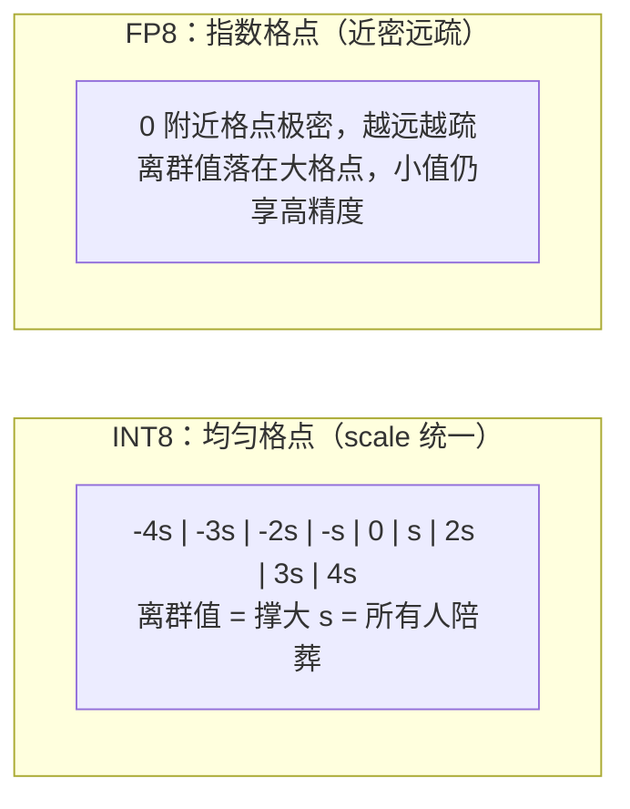

回看 4.2 节会注意到一个耐人寻味的事实：SmoothQuant 费尽心思对抗 Activation Outlier，本质上是在**替整数格式还债**——INT8 的格点是均匀分布的，一个大离群值就能把 scale 撑爆。那如果格点本身就不是均匀的呢？**浮点数的指数位让格点"近处密、远处疏"**，离群值天然落在稀疏的大格点上，根本不需要压平。这就是本章最后一块拼图：**从 INT 走向 FP**。而且这一次，是硬件推着软件走——Hopper 的 FP8 Tensor Core、Blackwell 的 FP4 Tensor Core 把低比特浮点做成了原生算力，量化从"省显存的妥协"变成了"吃满硬件的正道"。

<!-- more -->

## 📑 目录

- [1. 从 INT 到 FP：范式转移](#1-从-int-到-fp范式转移)
- [2. FP8 的两种格式：E4M3 vs E5M2](#2-fp8-的两种格式e4m3-vs-e5m2)
- [3. Hopper 的 FP8：W8A8 的新形态](#3-hopper-的-fp8w8a8-的新形态)
- [4. Blackwell 的 FP4：NVFP4 与 MXFP4](#4-blackwell-的-fp4nvfp4-与-mxfp4)
- [5. 生态落地](#5-生态落地)
- [总结](#-总结)
- [自我检验清单](#-自我检验清单)
- [参考资料](#-参考资料)

---

## 1. 从 INT 到 FP：范式转移

### 1.1 整数格点 vs 浮点格点

用一维数轴直观对比两种量化格点的排布：

- **整数量化**：所有格点等间距（都差一个 scale）。优点是反量化只是一个乘法（Kernel 友好），缺点是动态范围全靠 scale 硬扛——离群值问题（4.1~4.2 节）是它的原罪。
- **浮点量化**：格点由指数位 + 尾数位生成，**近 0 处密集、远离 0 处稀疏**。分布天然的"塔形"（大量小值 + 少量大值）恰好和它匹配——绝大多数数值落在密格点区，少数离群值落在疏格点区但**不需要任何额外处理**。

📌 **关键点**：范式转移的本质是——**INT 量化用"数学变换"（SmoothQuant/GPTQ/AWQ）对抗分布的不均匀；FP 量化用"非均匀格点"直接拥抱分布的不均匀**。后者在算法上近乎零成本（per-tensor 一个 scale 就够），代价则转嫁给了硬件设计——而这正是 NVIDIA 最近两代架构大张旗鼓做的事。

### 1.2 历史注脚

FP16/BF16 本身就是"16-bit 浮点量化"（相对 FP32）；FP8 不是新发明——早在深度学习训练用 FP32/FP16 混合的年代，E5M2 就在论文里讨论过。它真正爆发是在 **Hopper（H100，2022）把 FP8 Tensor Core 做成硬件原生算力**之后：有了 2 倍于 BF16 的吞吐和生态支持，算法侧立刻跟进（训练侧的 Transformer Engine、推理侧的 FP8 checkpoint 与 per-tensor scaling PTQ）。

---

## 2. FP8 的两种格式：E4M3 vs E5M2

FP8 一共 8 位：1 位符号 + 若干指数位 + 若干尾数位。两种标准切法：

| 📊 属性 | **E4M3**（4 指数 + 3 尾数） | **E5M2**（5 指数 + 2 尾数） |
|---|---|---|
| 尾数精度 | 3 bit → 相对精度约 2⁻⁴，好 | 2 bit → 相对精度约 2⁻³，差 |
| 动态范围 | 最大约 ±448，窄 | 最大约 ±57344，宽 |
| 典型用途 | **Weight / Activation / KV Cache**（推理主角） | **Gradient**（训练场景，梯度动态范围大） |

选择逻辑一句话：**推理数据的分布"集中但有离群值"——离群值再大也在几百量级，E4M3 的 ±448 足够兜住，而多一位尾数换来的精度更值钱**。训练梯度则是出了名的"既要极大又要极小"，E5M2 的宽范围更合适。这就是为什么 vLLM 里 `--kv-cache-dtype fp8_e4m3` 是推荐默认、而 `fp8_e5m2` 很少出现在推理配置里。

💡 **提示**：E4M3 的 ±448 上限偶尔也会被"踩破"——某些模型的激活离群值真超过 448 时会溢出。解法不是换 E5M2，而是配一个很小的 per-tensor scale 把数值整体压进范围（这也是 FP8 量化校准要做的全部工作——统计一个 scale，检查溢出即可）。

---

## 3. Hopper 的 FP8：W8A8 的新形态

### 3.1 算力账本

H100 的 Tensor Core 算力阶梯（稠密，仅列推理相关档位）：

| 精度 | H100 SXM 吞吐 | 相对倍数 |
|---|---|---|
| FP32 | ~67 TFLOPS | 1× |
| TF32 | ~495 TFLOPS | 7× |
| BF16 / FP16 | ~990 TFLOPS | 15× |
| **FP8** | **~1979 TFLOPS** | **30×** |

FP8 相比 BF16 **算力翻倍**，这改变了 W8A8 的收益结构：4.2 节的 INT8 W8A8 主要赚带宽（Decode 提速），而 FP8 W8A8 在 **Prefill（Compute Bound）也直接吃到 2 倍 GEMM 算力**——TTFT 和吞吐双双受益。再加上 4.4 节的 FP8 KV Cache，FP8 成了 Hopper 上的"全家桶"格式。

### 3.2 推理侧的 per-tensor scaling

FP8 量化的工程流程简单到令人感动（对比 GPTQ/AWQ 的逐层算法）：

- **Weight**：离线把 FP16 权重除以一个静态 scale（per-tensor，全局一个）转成 E4M3。
- **Activation**：运行时每个 GEMM 前动态统计 per-tensor scale（在线校准，公式即 4.1 节的 $s = \max|x| / 448$）。
- **GEMM**：FP8 × FP8 进 Tensor Core，累加用 FP16/FP32，输出前把两个 scale 乘回去。

没有 Hessian、没有误差补偿、没有平滑因子——**浮点格式把算法复杂度吃掉了**。DeepSeek-V3 等新一代模型更是直接用 FP8 训练并发布 FP8 权重，推理侧连"量化"这一步都省了。

⚠️ **注意**：per-tensor dynamic scaling 依赖"当前 batch 的激活分布"，极端 batch（全是异常输入）可能偶发溢出；生产级框架（TensorRT-LLM、vLLM）在 Kernel 里有饱和处理与 scale 后处理兜底。若自行实现 FP8 推理路径，务必处理溢出 NaN 的边界情况。

---

## 4. Blackwell 的 FP4：NVFP4 与 MXFP4

### 4.1 FP4：16 个格点的浮点

Blackwell（B200/GB200，2024）把故事推向 4-bit 浮点：**E2M1**——1 符号 + 2 指数 + 1 尾数，全部正数值只有 **{0.5, 1, 1.5, 2, 3, 4, 6}** 这 7 个（加负镜像和零）。单看格式寒酸至极：比 INT4 的 16 个均匀格点还"粗"。但它的 Tensor Core 吞吐相对 FP8 **再翻倍**，把"能不能用好 4-bit"的挑战扔给了算法层。

### 4.2 Block-wise Scaling：用两级 scale 救活 FP4

单靠 E2M1 表示不了真实权重分布，NVFP4/MXFP4 的共同答案是**块缩放（block-wise scaling）**——把向量切成小块，每块配一个独立的块级 scale：

| 🏷️ 方案 | 基础格式 | 块大小 | 块级 scale 格式 | 特点 |
|---|---|---|---|---|
| **MXFP4** | E2M1 | 32 元素/块 | E8M0（纯 2 的幂） | 遵循 OCP MX 标准，硬件友好 |
| **NVFP4** | E2M1 | 16 元素/块 | E4M3 + 全局 per-tensor 二级 scale | 块更细、scale 精度更高，**精度更好** |

直观理解 block-wise scale 的作用：即使 E2M1 的格点又粗又少，只要**每 16 个权重一组、给每组配一个精确的浮点 scale**，组内数值的实际表示粒度就由 scale 的精度决定——等于把"分布适配"的工作从格点设计转移到了两级 scale 上。这是"非均匀格点"思想的极致延伸。

### 4.3 微软论文的关键结论

《The Case for 4-bit Precision》系列（Microsoft，2024~2025）系统评测后给出的结论，直接定调了 FP4 生态：

- **NVFP4 在逐 Token 解码（batch ≤ 1/小 batch，Decode 主导）场景下，精度匹配 FP16/BF16 与 INT4 per-group 量化**——也就是说 4-bit 浮点 + 细块缩放，可以做到"视觉上无损"。
- 相对而言 MXFP4 因块更大（32）、scale 更粗（E8M0），精度略逊于 NVFP4，但仍是"可用且硬件标准化"的格式。
- 大 batch / 高吞吐服务场景下（对每元素精度要求更高的 GEMM 形态），4-bit 与 8-bit 之间仍有可测差距——**FP4 的甜点区在 Memory Bound 的 Decode**，这与 4.3 节 Weight-only INT4 的结论遥相呼应。

📌 **关键点**：Blackwell 上的选型直觉——**要精度上限选 FP8，要极致吞吐/显存密度选 NVFP4**。FP4 省一半于 FP8 的存储与带宽、翻倍于 FP8 的算力，而精度代价在小 batch Decode 场景几乎测不出来。

---

## 5. 生态落地

- **vLLM**：`--quantization fp8` 可对 FP16 checkpoint 做在线 per-tensor FP8 量化（几行配置吃到 Hopper 加速）；原生 FP8 checkpoint（DeepSeek-V3 等）开箱即用；NVFP4 支持随版本快速推进（compressed-tensors 生态）。
- **llm-compressor（vLLM 生态的量化工具）**：离线产出 FP8/NVFP4/MXFP4 的 compressed-tensors checkpoint，含校准与块缩放配置，是"自己动手做 FP8/FP4 模型"的标准入口。
- **TensorRT-LLM**：FP8/FP4 支持最全的商业栈，NVFP4 的一等公民。
- **模型发布趋势**：DeepSeek（FP8 训练原生发布）、各大社区（NVFP4 版 Llama/Qwen 快速跟进）——**新一代模型的"默认发行格式"正在从 FP16 迁移到 FP8/FP4**。

💡 **提示**：Hopper 用户的"最佳默认"已经很清晰：**FP8 权重 + FP8 KV Cache**，一行 quantization 配置加一行 kv-cache-dtype，几乎无精度损失地拿到显存减半与算力翻倍。INT 路线（GPTQ/AWQ）的价值区间收窄到两类：**老硬件（Ampere 及以前，无 FP8 单元）** 和**极致 4-bit 省显存需求**。这正是 4.6 节选型决策树的第一层分叉。

---

## 📝 总结

- 范式转移的本质：**INT 量化用算法（平滑/补偿）对抗分布不均，FP 量化用非均匀格点（近密远疏）直接拥抱分布不均**——离群值在浮点格式下天然无害。
- FP8 两种格式：**E4M3 精度高范围窄（推理的 Weight/Activation/KV 首选）**，E5M2 范围宽精度低（训练 Gradient 场景）。
- Hopper 上 FP8 相对 BF16 **算力翻倍**，W8A8 从"只赚 Decode 带宽"升级为"Prefill 算力 + Decode 带宽双赚"；工程只需 per-tensor scale（weight 静态、activation 在线动态），无复杂校准算法。
- Blackwell 的 FP4（E2M1）靠 **block-wise scaling** 救活：NVFP4（16 块 + E4M3 scale，精度更好）与 MXFP4（32 块 + E8M0，OCP 标准）；微软评测证实 **NVFP4 在小 batch Decode 场景精度匹配 FP16**，甜点区是 Memory Bound 的 Decode。
- 生态上，FP8 checkpoint（DeepSeek-V3 等）已是新一代模型的默认发行格式之一；**Hopper 用户默认 FP8 全家桶（权重+KV），FP4 服务 Blackwell 的极致吞吐，INT 路线退守老硬件与 W4 省显存场景**。

## 🎯 自我检验清单

- 能解释 INT 均匀格点与 FP 指数格点在应对离群值上的本质差异
- 能对比 E4M3 与 E5M2 的精度/范围取舍，并说明推理为什么选 E4M3
- 能算出 FP8 相对 BF16 的 Tensor Core 算力倍数，并推出它对 Prefill 与 Decode 分别意味着什么
- 能描述 FP8 per-tensor scaling 的完整流程（weight 静态 scale、activation 动态 scale、GEMM 后乘回）
- 能解释为什么 FP8 量化不需要 SmoothQuant 那样的等价变换
- 能说清 NVFP4 与 MXFP4 的块大小、scale 格式差异，以及 block-wise scaling 如何救活 E2M1 的粗格点
- 能指出 FP4 的精度甜点区（小 batch Decode）及其与 4.3 节 Weight-only 结论的呼应
- 能给出"Hopper 默认方案"与"Blackwell 默认方案"，以及 INT 路线如今的定位

## 📚 参考资料

- [FP8 Formats for Deep Learning（NVIDIA/Arm/Intel 联合的 FP8 白皮书）](https://arxiv.org/abs/2209.05433)
- [The Case for 4-bit Precision: k-bit Inference Scaling Laws（微软 FP4 系列论文）](https://arxiv.org/abs/2410.04169)
- [NVFP4 vs MXFP4 对比评测（微软后续工作）](https://arxiv.org/abs/2506.08027)
- [NVIDIA H100 Tensor Core 架构白皮书（FP8 算力规格）](https://resources.nvidia.com/en-us-tensor-core)
- [vLLM — Quantization（FP8 在线量化与 checkpoint 加载）](https://docs.vllm.ai/en/latest/features/quantization/)
- [llm-compressor（vLLM 生态量化工具链）](https://github.com/vllm-project/llm-compressor)
