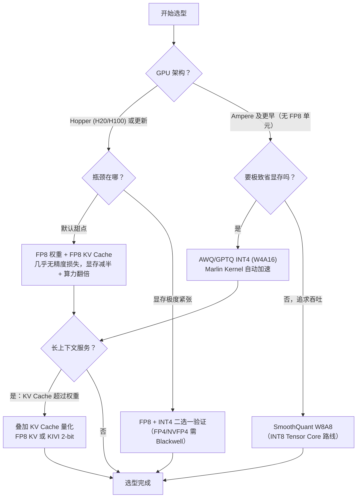

前五节把量化的武器库盘了一遍：数学基础（4.1）、W8A8 与离群值（4.2）、Weight-only INT4（4.3）、KV Cache 量化（4.4）、FP8/FP4 浮点路线（4.5）。这一节做两件事：**先收敛**——把所有方案压成一张决策树和一张对比总表，给你"五分钟选型"的能力；**再落地**——在 vLLM 里把 AWQ-INT4、FP8、KV Cache 量化逐个跑起来，用真实的 Benchmark 命令对比 FP16 与 AWQ 的吞吐，最后排一遍实战中最高频的坑。

<!-- more -->

## 📑 目录

- [1. 选型决策树](#1-选型决策树)
- [2. 方案对比总表](#2-方案对比总表)
- [3. vLLM 的量化生态](#3-vllm-的量化生态)
- [4. 实战一：部署 AWQ-INT4 模型](#4-实战一部署-awq-int4-模型)
- [5. 实战二：FP8 模型部署与在线量化](#5-实战二fp8-模型部署与在线量化)
- [6. 实战三：启用 KV Cache 量化](#6-实战三启用-kv-cache-量化)
- [7. 实战四：自制量化 checkpoint](#7-实战四自制量化-checkpoint)
- [8. Benchmark：FP16 vs AWQ-INT4](#8-benchmarkfp16-vs-awq-int4)
- [9. 常见坑与规避](#9-常见坑与规避)
- [总结](#-总结)
- [自我检验清单](#-自我检验清单)
- [参考资料](#-参考资料)

---

## 1. 选型决策树

量化选型的两个第一性问题：**你的硬件是什么**（决定能不能吃浮点路线的硬件原生加速）、**你的瓶颈是什么**（显存不够、KV Cache 太大，还是算力不够）。



📌 **关键点**：决策树的前两层是**硬件代际**和**瓶颈类型**，而不是"哪个算法更先进"。在 Ampere 上追 FP8 是无米之炊，在 Hopper 上死守 GPTQ 则是拿着新引擎烧旧油——先定硬件，再定瓶颈，算法自然收敛。

---

## 2. 方案对比总表

| 📊 方案 | 比特（W/A/KV） | 精度 | 硬件要求 | 典型收益 | 对应小节 |
|---|---|---|---|---|---|
| FP16 基线 | 16/16/16 | — | 通用 | — | — |
| SmoothQuant W8A8 | 8/8/16 | 接近无损 | INT8 Tensor Core（Turing+） | Prefill/Decode 双提升 | 4.2 |
| GPTQ / AWQ INT4 | 4/16/16 | 轻微损失（复杂任务可感） | 通用（Marlin 需算力 ≥ 7.5） | 显存/带宽 1/4，Decode 提速 | 4.3 |
| FP8 W8A8 | 8/8/16 | 几乎无损 | **Hopper+** | 显存减半 + 算力翻倍 | 4.5 |
| FP8 KV Cache | 16/16/**8** | 几乎无损 | Hopper+（软支持更广） | 上下文容量翻倍 | 4.4 |
| KIVI KV 2-bit | 16/16/**2** | 接近 FP16（需验证） | 通用 | 上下文容量 ×4~8 | 4.4 |
| NVFP4 / MXFP4 | 4(块缩放)/16 或 4/16 | 小 batch Decode 匹配 FP16 | **Blackwell** | 相对 FP8 再翻倍吞吐 | 4.5 |

读表的两个提醒：

- **方案可叠加**：权重侧（选一行）+ KV 侧（再选一行）是两个独立开关，长上下文服务通常是"FP8 权重 + FP8 KV"或"AWQ-INT4 + FP8 KV"的组合拳。
- **精度列是统计规律不是承诺**：你的模型 + 你的任务才说了算，上线前永远跑一遍自己的评测（见第 9 节）。

---

## 3. vLLM 的量化生态

vLLM 对量化的支持是"**格式自动识别 + Kernel 自动路由**"：模型的 HF 配置里带了量化信息（`quantization_config`），加载时自动选对应的实现；同一格式（如 GPTQ）会根据 batch 大小、GPU 型号自动切换到最快的 Kernel（Marlin 系列）。常用格式与启动方式：

| 🏷️ 格式 | checkpoint 特征 | 启动方式 |
|---|---|---|
| GPTQ / AWQ | 目录名含 `-gptq` / `-awq`，config 有 `quantization_config` | `vllm serve <model>` 自动识别，通常无需额外参数 |
| FP8 checkpoint | 如 DeepSeek 系列、`*-fp8` 模型 | 自动识别 |
| FP8 在线量化 | 普通 FP16 模型 | `--quantization fp8`（Hopper 上几行配置拿到收益） |
| compressed-tensors | llm-compressor 产出的统一格式（FP8/NVFP4 等） | 自动识别 |
| KV Cache 量化 | 独立于权重格式 | `--kv-cache-dtype fp8_e4m3` |

💡 **提示**：vLLM 的量化特性（支持格式、推荐参数）几乎每个 minor 版本都在更新——选型时以你部署版本的[官方文档](https://docs.vllm.ai/en/latest/features/quantization/)为准，本文给的命令以"近期版本"为准（参数名可能微调，语义稳定）。

---

## 4. 实战一：部署 AWQ-INT4 模型

最常见场景：7B~32B 模型塞进单卡，追求 Decode 吞吐。直接用社区现成的 AWQ checkpoint：

```bash
# 以 Qwen2.5-7B-Instruct 的社区 AWQ 版为例
vllm serve Qwen/Qwen2.5-7B-Instruct-AWQ \
    --max-model-len 8192 \
    --gpu-memory-utilization 0.90
```

验证要点：

- 启动日志确认量化格式被识别（会打印 `quantization` 相关行），并留意 Kernel 选择（Marlin 系）是否生效——**如果回落到慢速 Kernel，INT4 的速度收益会大打折扣**（见 4.3 节第 6 节的成因）。
- 对比 FP16 版本的显存占用：7B 模型应从 ~14 GB 权重降到 ~5 GB 左右（含 scales 与激活），一张 24 GB 消费卡即可流畅服务。
- 如果模型没有现成 AWQ 版本，走第 7 节的自制流程。

---

## 5. 实战二：FP8 模型部署与在线量化

**情况 A：模型已是 FP8 checkpoint**（如 DeepSeek-V3、社区的 `*-fp8` 模型）——开箱即用：

```bash
vllm serve deepseek-ai/DeepSeek-V3 \
    --max-model-len 32768 --gpu-memory-utilization 0.92
```

**情况 B：手里只有 FP16 模型，Hopper 卡上想吃 FP8 加速**——在线量化，一行参数：

```bash
vllm serve meta-llama/Llama-3.1-8B-Instruct \
    --quantization fp8
```

在线 FP8 会在加载时为每层权重计算静态 scale（per-tensor），激活 scale 在运行时动态统计（4.5 节的流程）。注意：

- 在线量化省显存、提速 Decode，但 **Prefill 的收益取决于 Kernel 对动态 scale 的处理**，总体不如离线 FP8 checkpoint 干净——生产环境更推荐用 llm-compressor 产离线 checkpoint（第 7 节）。
- 非 Hopper 卡上该参数无效或报错——硬件代际是硬门槛。

---

## 6. 实战三：启用 KV Cache 量化

与权重侧方案任意叠加（4.4 节已详述原理，这里是操作）：

```bash
vllm serve meta-llama/Llama-3.1-8B-Instruct \
    --quantization fp8 \
    --kv-cache-dtype fp8_e4m3 \
    --max-model-len 32768
```

启动日志里找 KV Cache 块数：相对 FP16 KV 应约 **翻倍**（`# CUDA blocks` 类似字段）。如果服务的典型请求是 32K 上下文的多轮对话，这一行参数基本等于免费把并发上限翻倍。启用后务必跑一遍自己的长上下文评测再切流（4.4 节第 5 节的交互与验证方法）。

---

## 7. 实战四：自制量化 checkpoint

当目标模型没有现成量化版，或业务分布特殊需要定制校准时，用 **llm-compressor**（vLLM 生态标准工具，产出 compressed-tensors 格式）：

```python
# pip install llmcompressor
from llmcompressor.transformers import oneshot
from llmcompressor.modifiers.quantization import QuantizationModifier

recipe = QuantizationModifier(
    scheme="FP8_DYNAMIC",   # 也可选 W8A8_INT / W4A16 等
    ignore=["lm_head"],     # 敏感层跳过量化
)
oneshot(
    model="meta-llama/Llama-3.1-8B-Instruct",
    recipe=recipe,
    output_dir="./Llama-3.1-8B-Instruct-fp8",
    max_seq_length=8192,
    num_calibration_samples=512,   # 校准样本数，几百条即可
)
# 产出目录直接 vllm serve ./Llama-3.1-8B-Instruct-fp8 即可加载
```

要点：

- **校准数据自带**：llm-compressor 默认从数据集采样，最好替换成业务真实样本（`--calibration-dataset` 类参数）——这是 4.1 节"校准分布"结论的落地。
- `ignore` 列表：lm_head、embedding 等输出敏感层通常跳过，几乎所有主流量化方案都这么处理。
- 产出是 compressed-tensors 统一格式，vLLM 自动识别，无需指定 quantization 参数。

---

## 8. Benchmark：FP16 vs AWQ-INT4

量化不是"启用即赚"，必须用数据说话。用 vLLM 自带的基准工具对比同一模型的 FP16 与 AWQ 版本（以 7B、单卡、固定输入输出长度为例的**典型形态**——绝对数字随硬件/版本变化，重点是相对关系和方法）：

```bash
# 吞吐测试（离线批处理模式，报告 tokens/s）
vllm bench throughput \
    --model Qwen/Qwen2.5-7B-Instruct \
    --input-len 2048 --output-len 512

vllm bench throughput \
    --model Qwen/Qwen2.5-7B-Instruct-AWQ \
    --input-len 2048 --output-len 512
```

典型的结果形态（示意）：

| 📊 指标 | FP16 | AWQ-INT4 | 说明 |
|---|---|---|---|
| 权重显存 | ~15 GB | ~5 GB | 大头收益，直接决定部署形态 |
| 最大可用 batch | 受显存限制 | 显著更大 | 省下的显存换并发 |
| Decode 吞吐（大 batch） | 基线 | **更高** | Memory Bound：带宽省 4 倍 + batch 更大 |
| Prefill 吞吐 | 基线 | 持平或略降 | Compute Bound 无收益，反量化有开销 |
| 生成质量（通用任务） | 基线 | 轻微差异 | 复杂推理任务需单独验证 |

📌 **关键点**：解读量化 Benchmark 的正确姿势——**分阶段看（Prefill/Decode）、分负载看（batch 大小）**。"AWQ 提升 X%"这种单数字结论是没有意义的：小 batch 下提升来自带宽减半，大 batch 下提升主要来自"显存省下来 → batch 上限抬高"的第二级效应，两者的机理完全不同（第 1 章的 Roofline 框架在这里直接复用）。

---

## 9. 常见坑与规避

排一遍实战中出镜率最高的坑：

- **校准分布失配**：通用语料校准、垂直领域上线，精度悄悄滑坡。规避：校准集 = 业务真实样本（几百条就够）；上线后灰度对比生成质量。
- **只测 PPL 不测任务**：PPL 几乎不动，但代码生成/数学推理/长上下文检索明显掉分。规避：用目标任务的评测集（GSM8K、HumanEval、大海捞针……）做量化前后的回归。
- **Kernel 静默回落**：INT4 模型加载成功但没走 Marlin（版本不支持、group_size 非标），速度没提升还以为量化没用。规避：看启动日志的 kernel 选择；坚持标准配置（`group_size=128`）。
- **TTFT 上升被忽视**：Weight-only 方案 Prefill 不加速甚至略慢，短 prompt + 长输出的服务里 TTFT 变化不大，但长 prompt 场景要单独看 TTFT 指标。
- **量化 × 投机解码叠加以精度换速度**：投机解码（第 5 章）对目标模型的分布偏移敏感，量化误差 + 投机验证组合可能放大接受率下降。规避：两个开关一起动时重新调优 Acceptance Rate。
- **FP8 溢出**：极端输入下激活超过 E4M3 范围产生 NaN。规避：用框架内置的饱和处理；自行实现时显式 clip。
- **忘了 KV Cache 这半个战场**：只量化权重，长上下文服务里 KV Cache 仍然吃掉大半显存。规避：看显存水位决定是否叠加 `--kv-cache-dtype`。

⚠️ **注意**：所有量化上线都应遵循同一流程——**离线评测（任务级）→ 性能 Benchmark（分阶段）→ 灰度切流 → 线上质量监控**。量化是"用精度换性能"的交易，每一单都要有对账单。

---

## 📝 总结

- 选型先问两个问题：**硬件代际**（Hopper+ 走 FP8/FP4 浮点路线，Ampere 及以前走 INT 路线）与**瓶颈类型**（权重显存 → INT4/FP8；KV Cache → KV 量化；算力 → W8A8）。
- Hopper 的默认甜点是 **FP8 权重 + FP8 KV Cache**；Blackwell 的极致档是 NVFP4；AWQ/GPTQ 退守老硬件与极致省显存场景；长上下文服务里权重与 KV 量化是**叠加使用的两个独立开关**。
- vLLM 生态：**格式自动识别 + Kernel 自动路由**；GPTQ/AWQ/FP8 checkpoint 开箱即用，FP16 模型可 `--quantization fp8` 在线量化，自制模型用 llm-compressor 产出 compressed-tensors。
- 解读量化 Benchmark 必须**分阶段（Prefill/Decode）分负载（batch 大小）**：Weight-only 的 Decode 收益来自带宽与大 batch 的第二级效应，Prefill 无收益。
- 高频坑集中在：**校准分布、任务级评测缺失、Kernel 静默回落、量化与投机解码的叠加**——规避方式是统一的离线评测 + 灰度 + 监控流程。

## 🎯 自我检验清单

- 能不看资料画出量化选型决策树的前两层（硬件代际 × 瓶颈类型）
- 能为三种典型场景给出方案组合：A100 上跑 7B 追吞吐、H100 上跑 70B 长上下文、4090 上跑 32B
- 能说明"FP8 权重 + FP8 KV"为什么是 Hopper 默认甜点
- 能说出 vLLM 加载 GPTQ/AWQ/FP8 模型时分别需要什么参数、Kernel 路由发生在哪一步
- 能用 llm-compressor 产出一个 FP8 checkpoint 并指出校准数据的关键性
- 能解释 AWQ-INT4 的 Decode 提速在大 batch 下的"第二级效应"来自哪里
- 能列出量化上线前必须做的评测项（任务级 + 分阶段性能）
- 能说出量化与投机解码叠加时需要额外关注什么指标

## 📚 参考资料

- [vLLM — Quantization 官方文档（格式支持与参数）](https://docs.vllm.ai/en/latest/features/quantization/)
- [vLLM — Engine Arguments（quantization / kv-cache-dtype）](https://docs.vllm.ai/en/latest/configuration/engine_args.html)
- [llm-compressor 官方仓库（FP8/FP4 checkpoint 制作）](https://github.com/vllm-project/llm-compressor)
- [vLLM 官方基准工具（vllm bench）](https://docs.vllm.ai/en/latest/benchmarks/benchmarks.html)
- [AWQ / GPTQ / SmoothQuant / KIVI 论文（见前五节参考资料）](https://arxiv.org/abs/2306.00978)
