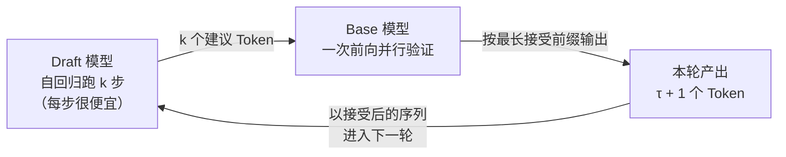
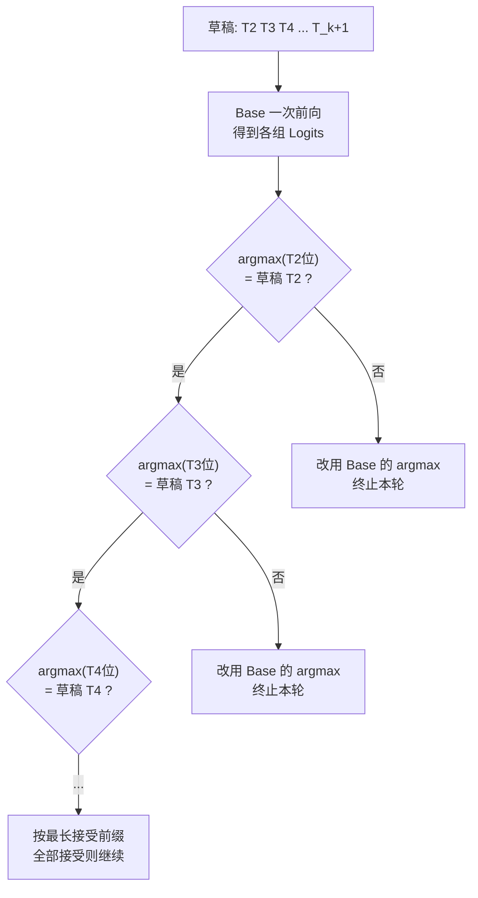

第 1 章我们算过一笔账：LLM 是自回归模型，Decode 阶段一个 Token 一个 Token 地出，第 $t+1$ 个 Token 必须等第 $t$ 个算完才能开始；而每算一个 Token，都要把整个模型的权重从显存完整搬一遍——**串行依赖 + Memory Bound**，是 Decode 慢的总根源。前面几章的优化各砍一刀：量化（第 4 章）把"搬运的字节"减少，Continuous Batching（2.2 节）把"搬一次权重服务多少请求"摊薄。但请注意，**单个请求的 Decode 依然是串行的**——这些手段都没有打破自回归本身的循环。

投机解码（Speculative Decoding，也叫投机采样）打破串行的方式非常聪明：Memory Bound 意味着 GPU 大量算力闲置，那么**一次前向多算几个 Token 几乎是免费的**——既然如此，为什么不先让一个小模型把后面的 Token "猜"出来，再让 Base 模型一次前向统一验证？这就是"先猜后验"。它是本章所有方法（EAGLE-3、MTP、DFlash、DSpark）共同的框架地基。

<!-- more -->

## 📑 目录

- [1. 为什么 Decode 慢：串行与 Memory Bound](#1-为什么-decode-慢串行与-memory-bound)
- [2. 核心思想：Draft + Verify](#2-核心思想draft--verify)
- [3. 验证机制：以贪婪采样为例](#3-验证机制以贪婪采样为例)
- [4. 为什么无精度损失](#4-为什么无精度损失)
- [5. 加速比：一切取决于接受长度](#5-加速比一切取决于接受长度)
- [6. 草稿从哪来：本章演进地图](#6-草稿从哪来本章演进地图)
- [总结](#-总结)
- [自我检验清单](#-自我检验清单)
- [参考资料](#-参考资料)

---

## 1. 为什么 Decode 慢：串行与 Memory Bound

### 1.1 串行依赖是总根源

自回归生成的定义就是：第 $t+1$ 个 Token 的分布依赖于前 $t$ 个 Token。这个依赖无法在单请求内并行——你不能在算出第 100 个 Token 之前就开始算第 101 个，因为它俩之间的因果关系还没确定。

于是 Decode 的延迟有一个硬性的下界：**生成 $N$ 个 Token，至少要串行跑 $N$ 次前向**。无论硬件多快、Kernel 多优秀，这个次数砍不下来。

### 1.2 Memory Bound 的另一面：多算几个 Token 近似免费

但第 1 章的 Roofline 分析还给了我们另一个结论：Decode 每步只处理 1 个 Token，矩阵乘退化为矩阵-向量乘，**瓶颈是搬权重，而不是算**。把这个结论反过来读，就是投机解码的物理基础：

> **搬一遍权重的大头开销已经付了，多顺便算几个 Token 的边际成本极低。**

具体一点：给 Base 模型一次输入 $k$ 个 Token（batch 维度上变成 $k$ 行），权重依然只搬一遍；GEMM 从"矩阵-向量"变回"矩阵-矩阵"，多出的计算量对 Memory Bound 的 Decode 来说几乎不增加耗时——这正是 2.2 节里"批处理近乎免费"的同一个论证，只不过这里的"$k$ 个 Token"不是来自 $k$ 个请求，而是**来自同一个请求的 $k$ 个"猜测"**。

📌 **关键点**：投机解码的全部机会，都建立在"**验证 $k$ 个 Token 和验证 1 个 Token 的耗时几乎一样**"这个事实之上。如果 Decode 是 Compute Bound 的，验证 $k$ 个 Token 要花 $k$ 倍算力，整个方法就无利可图。所以投机解码天然是 Decode 阶段（Memory Bound）的优化，对 Prefill 没有意义。

---

## 2. 核心思想：Draft + Verify

### 2.1 两个角色

- **Draft（草稿）模型**：一个小而快的模型（比如 1B 级别，甚至只是几个轻量层），负责"猜"。它自己也是自回归的，生成 $k$ 个建议 Token 要老老实实跑 $k$ 步——但每一步都比 Base 模型便宜一到两个数量级。
- **Target / Base 模型**：真正的大模型，负责"验"。它一次 Decode 前向就能并行验证全部 $k$ 个草稿 Token（利用的正是 1.2 节那个"多算几个近乎免费"的性质）。

### 2.2 一次投机循环

算一笔账：如果草稿质量很高、$k$ 个建议 Token 全部被 Base 接受，那么我们用**$k$ 次草稿模型推理的代价 + 1 次 Base 模型推理的代价，产出了 $k$ 个 Token**（外加验证前向顺带产出的 1 个"奖励 Token"，见第 3 节）。由于草稿每步的开销远小于 Base 一步，等价于把 Base 的串行次数压缩了接近 $k$ 倍。

如果草稿质量很差呢？Base 第一个就拒绝，这一轮只产出 1 个 Token，草稿的 $k$ 步和验证多算的 Token 全部白费——**比不投机还慢**。所以投机解码从来不是稳赚的买卖，它的一切取决于草稿模型的质量，我们在第 5 节定量分析这一点。

💡 **提示**：注意"验证"并不是把 Token 再生成一遍——Base 模型只跑**一次**前向，输入是草稿的 $k$ 个 Token，输出是 $k$ 组 Logits，每组都足以判定"对应位置的草稿 Token 是否正确"。一次前向、批量裁决，这是它和朴素的多跑几步的本质区别。

---

## 3. 验证机制：以贪婪采样为例

无精度损失是投机解码最反直觉也最迷人的性质。先把贪婪采样（greedy，温度为 0）下的完整流程走一遍，这一套流程是所有变体（树状草稿、多头草稿、块草稿）共用的骨架：

1. **Prefill + 首 Token**：Base 模型对 Prompt 做 Prefill，生成第一个 Token $T_1$。
2. **草稿展开**：草稿模型在 $T_1$ 的基础上自回归推理 $k$ 次，依次生成建议 Token $T_2 \sim T_{k+1}$。注意这些 Token 只是草稿模型的"猜测"，此刻没有任何正确性保证。
3. **拼接送验**：把 $T_2 \sim T_{k+1}$ 这 $k$ 个草稿 Token 拼接到 $T_1$ 之后，一并送入 Base 模型做一次前向。
4. **提取 Logits**：这次前向输出 $k$ 组 Logits，其中第 $i$ 组 Logits（对应位置 $T_{i+1}$ 的输入）给出的正是"Base 在看到 $T_1 \cdots T_i$ 后，对下一个 Token 的预测分布"——也就是对草稿 Token $T_{i+1}$ 的裁决依据。
5. **逐位比对**：按顺序观察每组 Logits 的最高概率 Token（argmax）是否恰好等于草稿提议的 Token：
   - **是** → 接受这个 Token，继续观察下一位；
   - **否** → **拒绝草稿的提议，改用 Base 自己 Logits 中的 argmax Token**，并终止本轮（后面的草稿全部作废——它们是建立在错误前缀上的，已经没有意义）。

📌 **关键点**：终止规则是"**第一个不匹配就停**"。因为验证是逐位串行语义的——$T_3$ 的裁决只在 $T_2$ 已被接受的前提下才成立。哪怕后面 $T_4$ 碰巧又对了，也不能跳过 $T_3$ 直接接受 $T_4$，因为 Base 对 $T_4$ 位置的 Logits 是以"$T_2$、$T_3$ 都成立"为条件算出来的。

### 奖励 Token：每轮至少产出 1 个

注意验证前向本身的最后一组 Logits（输入是草稿的最后一个 Token）会给出"下一个新 Token"的预测——**即使全部草稿被拒绝，这一轮也至少产出 1 个确认无误的 Token**。所以投机解码最坏情况是"退化成普通 Decode + 白花草稿开销"，永远不会卡住不出字。

---

## 4. 为什么无精度损失

### 4.1 贪婪采样的论证

回到上面的流程，逐个检查最终输出里的每个 Token：

- 被接受的 Token：Base 自己的 argmax 与草稿提议一致，接受它等价于 Base 独自生成时的选择；
- 被拒绝的位置：直接采用 Base 的 argmax，同样是 Base 自己的选择。

也就是说，**每个 Token 的最终裁决者都是 Base 模型自己的分布**——草稿模型自始至终只有"提案权"，没有"决定权"。用归纳法容易证明：最终输出序列与 Base 模型独自逐 Token 贪婪生成的序列**逐位相同**。草稿的唯一作用是影响"Base 要跑几次前向"，而不是"输出是什么"。

### 4.2 一般采样：Rejection Sampling 的严格保证

温度大于 0 时，"正确"不再是 argmax 一个点，而是"分布要一致"。此时验证规则换成经典的拒绝采样（Rejection Sampling）：设草稿分布为 $q(x)$、Base 分布为 $p(x)$，对草稿提议的 Token $x$：

$$
\text{接受概率} = \min\left(1,\ \frac{p(x)}{q(x)}\right)
$$

- 若接受，继续验证下一个草稿 Token；
- 若拒绝，从**修正分布** $\mathrm{norm}(\max(0,\ p(x) - q(x)))$ 中采样一个 Token 并终止。

Leviathan et al. 与 Chen et al. 在两篇开创性论文里证明了：这套规则下，最终生成序列的边际分布**严格等于**直接从 Base 采样。直觉上可以这么理解——草稿"猜得对"的地方（$q$ 高 $p$ 也高）大概率被接受，猜偏的地方（$p$ 低 $q$ 高）大概率被拒绝并由修正分布"纠偏"回来，一进一出恰好把分布掰回 $p$。

⚠️ **注意**：**无精度损失是算法层面的性质**，前提是"任何未被 Base 验证的 Token 都不能进入输出"。实践中精度问题几乎都出在工程实现：接受判定的 off-by-one、树状草稿的 Attention Mask 画错、修正分布采样有 bug 等。所以"投机解码无损"这句话，永远要附带一句"实现正确的前提下"。

---

## 5. 加速比：一切取决于接受长度

### 5.1 一个公式

定义**接受长度** $\tau$：每轮投机循环中，被 Base 接受的草稿 Token 数。每轮的成本和产出是：

- **成本**：$k$ 次草稿推理（每次 $t_d$）+ 1 次 Base 验证前向（$t_v$）
- **产出**：$\tau + 1$ 个 Token（$\tau$ 个被接受的草稿 + 1 个奖励 Token）

于是相对普通 Decode（每 Token 成本 $t_b$，$t_v \approx t_b$）的加速比约为：

$$
S \approx \frac{(\tau + 1) \cdot t_b}{k \cdot t_d + t_v} \approx \frac{\tau + 1}{1 + k \cdot t_d / t_b}
$$

两个极限情形把这个公式的两端说得很直白：

| 📊 情形 | $\tau$ | 加速比 | 结果 |
|---|---|---|---|
| 草稿全对（理想） | $k$ | $\dfrac{k+1}{1 + k \cdot t_d/t_b} \to k+1$ | 接近 $k+1$ 倍加速 |
| 草稿全错（最差） | $0$ | $\dfrac{1}{1 + k \cdot t_d/t_b} < 1$ | **比不投机还慢** |

### 5.2 连乘衰减：接受长度为什么难

更麻烦的是，接受长度不是"平均对多少个"的问题，而是**前缀连乘**的问题：

$$
P(\text{接受} \ge j \text{ 个}) = \prod_{i=1}^{j} p_i
$$

哪怕草稿每个位置的接受率 $p_i$ 都有 0.8，接受第 5 个 Token 的概率也只有 $0.8^5 \approx 0.33$。位置越靠后、越难猜（长程一致性、伏笔回收），$p_i$ 本身还在下降——接受长度被"连乘"结构天然压制。这正是后面 5.2 节树状草稿（用多路径对抗连乘）和 5.4 节块草稿（绕开链式依赖）要解决的核心矛盾。

### 5.3 两条结论

到此可以给出本章反复引用的两条结论：

1. **投机解码是无精度损失的**——裁决权始终在 Base 手里（第 4 节）。
2. **投机解码严重依赖草稿模型的生成质量**——草稿太差时接受长度过低，草稿开销和被浪费的验证计算反而拖慢推理（第 5 节的公式）。

不同任务的"可猜性"天差地别：代码生成、格式化输出高度可预测，接受率高、加速明显；开放域闲聊、创意写作的分支多、熵高，接受率低、收益有限。这也是为什么"投机解码要不要开、开多少"永远要拿自己的负载实测（呼应第 11 章的选型方法）。

---

## 6. 草稿从哪来：本章演进地图

框架定了（Draft + Verify + Rejection Sampling），剩下的问题就一个：**怎么让"草稿便宜"和"草稿准"同时成立**。后续四节是这个问题在四个方向上的答卷：

| 🏷️ 方法 | 核心思路 | 草稿形态 | 对应小节 |
|---|---|---|---|
| 独立小模型 | 直接用小模型当草稿 | 单链 | 本节一笔带过 |
| Medusa 等多头方案 | 主模型上加多个解码头 | 单链/多头 | 本节一笔带过 |
| **EAGLE-3** | 用 Base 多层 Hidden States 喂草稿 + 树状草稿 | **树** | 5.2 |
| **MTP** | 训练时的多 Token 预测头，推理时顺手当草稿 | **线性链** | 5.3 |
| **DFlash** | 块扩散一次前向出整块草稿 + Base 特征注入 KV | **并行块** | 5.4 |
| **DSpark** | 半自回归（并行主干+串行采样头）+ 系统级动态验证预算 | **并行块** | 5.5 |

- **猜得更准**（提升接受长度）：EAGLE-3 的答案是"让草稿看到 Base 的中间特征"；MTP 的答案是"训练时就把多步预测能力练进主模型"。
- **猜得更快**（降低草稿自身耗时）：DFlash 注意到草稿模型自己也是自回归的，用扩散式的一次前向整块生成换速度。
- **系统级权衡**：DSpark 把视角拉到整个服务系统——全局吞吐量 = 接受长度 × 每秒 Decode 次数，动态决定每轮验证多少。

💡 **提示**：早期的 Medusa 等方案本章不展开（实践中使用较少），直接从工程与学术上都已成为主流的 EAGLE-3 讲起。独立小模型路线的困境——分布对齐难、部署两套模型——恰好是理解 EAGLE 系"特征级草稿"动机的最佳背景，下一节从这讲起。

---

## 📝 总结

- Decode 慢的根源是**串行依赖 + Memory Bound**；Memory Bound 的另一面是"验证 $k$ 个 Token 与验证 1 个几乎一样贵"，这是投机解码全部收益的物理基础。
- 核心框架是 **Draft + Verify**：草稿模型自回归跑 $k$ 步出建议，Base 模型一次前向并行验证；全接受时，$k$ 次草稿 + 1 次 Base 前向产出 $k$ 个 Token。
- 贪婪采样下的验证：提取验证前向 Logits 中对应 $[T_2 \sim T_{k+1}]$ 的位置，逐位比对 argmax；一致则接受并继续，不一致则改用 Base 的 argmax 并终止。验证前向自带 1 个**奖励 Token**，最坏情况退化为普通 Decode。
- **无精度损失**：贪婪下输出与 Base 独自生成逐位相同；一般采样下 Rejection Sampling 保证边际分布严格等于 Base。前提是"未经验证的 Token 绝不输出"。
- 加速比 $S \approx (\tau+1)/(1 + k \cdot t_d/t_b)$：接受长度是唯一的胜利变量，且受连乘概率压制；草稿太差时比不投机还慢。
- 后续演进四条线：EAGLE-3（特征级 + 树）、MTP（训练副业的附加收益）、DFlash（草稿自身提速）、DSpark（系统级权衡）。

## 🎯 自我检验清单

- 能从"串行 + Memory Bound"推出投机解码的物理基础，并解释它为什么对 Prefill 无意义
- 能算清"全接受时用多少成本换多少 Token"，并解释奖励 Token 为什么保证每轮至少产出 1 个
- 能完整复述贪婪采样下的验证流程，并说明为什么"第一个不匹配就要终止"
- 能论证贪婪采样的无损性（裁决权在 Base），并能写出一般采样下的接受概率与修正分布
- 能写出加速比公式，并解释草稿全错时为什么比不投机还慢
- 能解释接受长度为什么受连乘概率压制，以及这对草稿设计意味着什么
- 能说出本章后续四节（EAGLE-3 / MTP / DFlash / DSpark）各自解决的是"准、快、系统权衡"中的哪一环

## 📚 参考资料

- [Fast Inference from Transformers via Speculative Decoding（Leviathan et al., Rejection Sampling 证明）](https://arxiv.org/abs/2211.17192)
- [Accelerating Large Language Model Decoding with Speculative Sampling（Chen et al., 独立同源工作的严格分布保证）](https://arxiv.org/abs/2302.01318)
- [Medusa: Adding LLM Heads for Faster Inference（多头草稿的代表性工作）](https://arxiv.org/abs/2401.10774)
- [Unlocking Efficiency in Large Language Model Inference: A Comprehensive Survey of Speculative Decoding（投机解码综述）](https://arxiv.org/abs/2401.07851)
