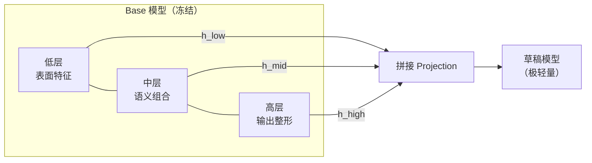

5.1 的结论很干脆：投机采样的成败在草稿。那草稿为什么难做？最朴素的想法——直接拿一个独立的小模型当草稿——有个致命伤：小模型只能看到 Token 序列本身，对"Base 这道题是怎么想的"一无所知，等于隔着一堵墙盲猜，接受率始终有限。EAGLE 系列的破局点就在这里：**让草稿在 Base 的特征空间里续写，而不是从 Token 重新理解题面**。到 EAGLE-3，这套思路被打磨成了当前自回归草稿的最强形态。本节从动机讲到结构，重点是它区别于前作的两个核心思想：多层 Hidden States 的输入，和等宽的树状草稿。

（早期的 Medusa 等多头方案这里不展开，谱系上知道"在主模型上挂多个解码头"是它的形态即可，本章直接从工程上已成为主流的 EAGLE-3 切入。）

<!-- more -->

## 📑 目录

- [1. 独立草稿的困境与 EAGLE 的洞察](#1-独立草稿的困境与-eagle-的洞察)
- [2. 核心思想一：多层 Hidden States](#2-核心思想一多层-hidden-states)
- [3. 核心思想二：树状草稿](#3-核心思想二树状草稿)
- [4. Training-Time Test：训练对齐推理](#4-training-time-test训练对齐推理)
- [5. 效果与引擎支持](#5-效果与引擎支持)
- [总结](#-总结)
- [自我检验清单](#-自我检验清单)
- [参考资料](#-参考资料)

---

## 1. 独立草稿的困境与 EAGLE 的洞察

### 1.1 独立小模型：盲猜

独立草稿路线的问题可以概括为"信息不对称"：

- Base 模型的每一步决策，建立在对整个上下文的深层表征之上；
- 独立小草稿能看到的只有 Token 序列，它必须**独自重建一遍对上下文的理解**，然后猜 Base 的下一步。

小模型的参数量和层数注定它重建的理解是粗糙的，草稿分布与 Base 分布天然对不齐——于是要么接受率上不去，要么把草稿做大、失去"便宜"的意义。部署上还要维护两个模型（tokenizer 对齐、版本同步），工程负担也不小。

### 1.2 EAGLE 的洞察：在 Base 的特征上续写

EAGLE 系列换了一个视角：**别让草稿自己理解题面，直接把 Base 的理解喂给它**。

具体做法是：草稿模型的输入不再是（只有）Token 序列，而是 **Base 模型的 Hidden States**——Base 刚刚验证完前缀时，内部各层已经算好了对整个上下文的表征，这个表征"免费"可得（验证前向的副产品）。草稿拿到的信息从"题面"升级成了"Base 解题到一半的思路"，在这个基础上猜下一步，接受率自然大幅提升。

🔑 **核心概念**：这叫**特征级草稿（feature-level drafting）**——草稿自回归的"语言"不再是 Token，而是 Base 的特征。Token 是 Base 思考后的"发言稿"，特征才是思考本身。EAGLE 论文给这种依赖起了个直白的名字：**草稿与 Base 的分布错位被消除了**。

---

## 2. 核心思想一：多层 Hidden States

### 2.1 EAGLE-3 的观察：到最后一层，语言信息已经丢了

EAGLE-1/2 喂给草稿的是 Base **最后一层**的 Hidden States。EAGLE-3 往深处多问了一句：最后一层的特征是好的草稿输入吗？答案是未必——**走到 logits 或最后一层 Hidden States 的阶段时，很多语言信息已经丢失了**。

原因不难理解：Transformer 的最后几层在做"输出准备"——把丰富的中间表征逐步压缩、整形为能在词表上输出的分布形态。这个过程的副作用是，许多对"预测下一步"仍然有用的信息（语义分支、句法伏笔、多个候选的竞争关系）在高层被当作"与最终输出无关的噪音"滤掉了。拿一个已经被压扁的特征去喂草稿，草稿能看到的信息是有损的。

### 2.2 做法：低、中、高三个层级各取一层，拼接

EAGLE-3 的做法：**从 Base 模型的低层、中层、高层各提取一层 Hidden States，拼接后作为草稿模型的输入**。



三层的分工大致是：低层保留词法、表面形式的细节；中层承载语义组合与推理痕迹；高层提供已经收敛的输出倾向。三者拼接，草稿同时拿到"原始素材 + 思考过程 + 倾向性"，比单看最后一层信息量大得多。

💡 **提示**：这个设计还有一个隐性收益——中间层特征本来就在前向传播中被算了出来，提取它们**几乎不增加 Base 的推理成本**，只是多一次读取和投影。EAGLE-3 论文里"用更深的监督信号换更高的接受率"这笔回报极厚的交易，成本侧几乎为零。

---

## 3. 核心思想二：树状草稿

### 3.1 单链的问题：连乘

5.1 节讲过接受长度的连乘困境：单条草稿链每步只提 1 个候选（top-1），接受率 0.8 的链走到第 5 个 Token 只剩 $0.8^5 \approx 0.33$ 的存活率。链越长，"一步猜错全链报废"的期望损失越大。

### 3.2 EAGLE-3 的做法：每步 top-k，长成草稿树

EAGLE-3 的第二个核心思想是**树状草稿**：

1. **每步取 top-k，不再取 top-1**：草稿模型每推理一步，对下一步的建议不是 1 个 Token，而是概率最高的 $k$ 个（连同上一层的候选）展开成多分支；
2. **按概率剪枝，保持等宽**：步数 × 分支数会让候选组合**爆炸式增长**（$k$ 层 top-k 就是 $k^k$ 量级的路径），所以每一步都对整棵草稿树**按概率值筛选**——把累积概率低的路径剪掉，最终保留一棵**等宽的草稿树**（每层节点数恒定，验证成本可控）。

```mermaid
graph TD
    R["根：已验证前缀"] --> A["a₁ (0.6)"]
    R --> B["b₁ (0.3)"]
    A --> A2["a₂ (0.4)"]
    A --> B2["b₂ (0.2)"]
    A --> C2["c₂ (0.15)"]
    B --> D2["d₂ (0.1)"]
    B -.-"累积概率过低<br/>被剪枝" .-> X["✂️"]
```

剪枝的判据是路径的**累积概率**：根到某个节点的概率连乘。等宽意味着无论树多深，一次验证的 Token 总数恒定——Base 验证的成本是可预期的（这正是"验证 $k$ 个 Token 近似免费"红利在树形下的延续）。

3. **一次前向验证整棵树**：树上的 Token 按祖先关系构造特殊的 Attention Mask（每个草稿 Token 只能看见自己的祖先链，即 Tree Attention），Base 一次前向算出所有节点的 Logits，然后按"从根到叶、逐节点比对"的规则，取**接受概率最高的那条路径**作为本轮输出。

📌 **关键点**：树状草稿本质上是**用计算换连乘概率**——单链第 $j$ 步的存活率是 $\prod p_i$，树上有 $k$ 个分支的节点存活率是 $1 - \prod(1 - p_i^{(j)})$，永远是后者更高。而"多算的这些分支"吃的是 Memory Bound 的免费红利。这就是 EAGLE 系从 EAGLE-2（动态树）到 EAGLE-3 一以贯之的主线。

---

## 4. Training-Time Test：训练对齐推理

EAGLE-3 还有一处对工程思维很有启发的改进：**训练时就把推理时的特征提取流程搬进训练循环**，论文称之为 Training-Time Test。

- EAGLE-1/2 训练时用"标准答案 Token"对应的特征做输入——但推理时，草稿输入的特征来自"草稿自己上一步的输出"（可能是被拒绝的猜测），训练和推理的输入分布存在错位；
- EAGLE-3 在训练时就模拟推理的展开方式提取特征，让草稿在"自己猜的上下文"上训练，消除了这个分布错位。

⚠️ **注意**：这是 EAGLE-3 相对前作接受率提升的重要来源，也值得作为通用方法论记住——**草稿模型的一切训练设计，都应该以"推理时它实际看到什么"为准**。MTP（5.3 节）的后续工作 FastMTP 修的也是同一类错位。

至于草稿模型本身：EAGLE 系的草稿网络非常轻（单层 Transformer 量级），共享 Base 的 Embedding 与 LM Head，训练只动草稿自己——参数量相对 Base 几乎可以忽略，训练成本远低于重训一个小模型。

---

## 5. 效果与引擎支持

### 5.1 效果

- EAGLE-3 在代码、摘要、翻译等主流任务上普遍拿到 **2~4 倍**的无损加速（接受长度视任务而异），是目前自回归草稿的代表性基线；
- 它的对手不再只是"不投机"，还有后来者：DFlash（5.4 节）论文报告在其评测下相对 EAGLE-3 最高 2.5 倍的速度优势，DSpark（5.5 节）报告接受长度超出 EAGLE-3 约 26%~31%。

### 5.2 引擎支持

EAGLE-3 已经是推理引擎的一等公民：vLLM（`speculative_config` 指定 EAGLE 草稿模型）与 SGLang（EAGLE3 系列参数）都有原生支持，加载社区训练好的 EAGLE-3 草稿权重即可开启。

### 5.3 软肋：草稿模型自己也是自回归的

但 EAGLE-3 有一个与生俱来的结构性软肋，也是理解 5.4、5.5 两节的钥匙——**草稿模型自己也是自回归模型，也要一个 Token 一个 Token 地出**。

- 生成长度为 $k$ 的草稿（哪怕每步都取了 top-k），草稿自身要老老实实串行跑 $k$ 步。每步虽然便宜，但串行延迟是累积的；
- 草稿深度的增加受"串行耗时 × 连乘衰减"两头挤压，实际加速被压在 2~3 倍这个量级很难再上探。

接受率高、草稿耗时也高——这就是 DFlash 出场前，投机采样面对的基本盘。

---

## 📝 总结

- 独立小草稿的困境是信息不对称：只能从 Token 盲猜，与 Base 分布对不齐。EAGLE 的洞察是**特征级草稿**——直接把 Base 的 Hidden States 喂给草稿，让草稿在 Base 的"思路"上续写。
- EAGLE-3 核心思想一：**到 logits / 最后一层时很多语言信息已丢失**，因此从 Base 的**低、中、高三个层级各取一层 Hidden States 拼接**作为草稿输入，中间层特征的提取几乎零成本。
- EAGLE-3 核心思想二：**树状草稿**——每步建议取 top-k 而非 top-1 展开成树；为防止候选爆炸，按累积概率剪枝，最终保留一棵**等宽草稿树**；验证用 Tree Attention 一次前向完成，取最优路径。本质是用 Memory Bound 的免费算力对抗连乘衰减。
- **Training-Time Test** 把推理时的特征提取流程搬进训练循环，消除训练/推理的输入分布错位；草稿网络本身极轻（单层 Transformer 量级），共享 Base 的 Embedding 与 LM Head。
- 效果：主流任务 2~4 倍无损加速；vLLM / SGLang 原生支持。软肋：**草稿自身仍是自回归执行**，串行耗时随草稿长度累积——这是 5.4 节 DFlash 的直接靶子。

## 🎯 自我检验清单

- 能解释独立小草稿"盲猜"困境的成因，以及特征级草稿如何消除分布错位
- 能说清 EAGLE-3 为什么不用最后一层特征——"到 logits 阶段很多语言信息已丢失"意味着什么
- 能描述低/中/高三层 Hidden States 拼接输入的结构，以及它近乎零成本的提取方式
- 能从连乘概率出发论证"为什么单链草稿吃亏"，以及 top-k + 概率剪枝如何把树控制成等宽
- 能解释 Tree Attention 验证的基本原理（节点只见祖先链）与"取最高接受概率路径"的输出规则
- 能说出 Training-Time Test 解决的是什么错位，并把这个原则迁移到其他草稿训练上
- 能指出 EAGLE-3 的结构性软肋（草稿自回归串行），以及它为后续方法留出的改进空间

## 📚 参考资料

- [EAGLE-3: Scaling up Inference Acceleration of Large Language Models via Training-Time Test](https://arxiv.org/abs/2503.01840)
- [EAGLE-2: Faster Inference of Language Models with Dynamic Draft Trees](https://arxiv.org/abs/2406.16858)
- [EAGLE: Speculative Sampling Requires Rethinking Feature Uncertainty（EAGLE-1）](https://arxiv.org/abs/2401.15077)
- [EAGLE 系列项目主页（SafeAILab/EAGLE，含代码与草稿权重）](https://github.com/SafeAILab/EAGLE)
