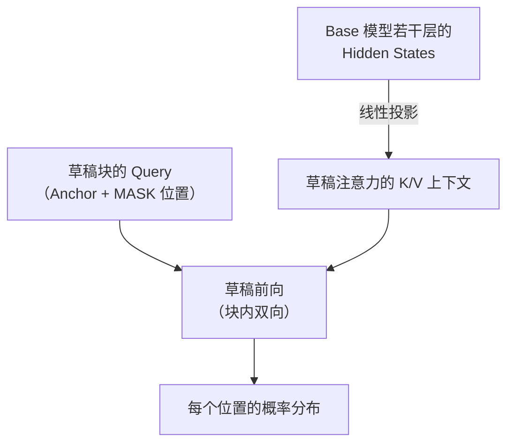

前三节的方法都在回答同一个问题：**怎么让草稿猜得更准**。DFlash 换了一个问题：**怎么让草稿跑得更快——同时尽可能少地降低接受长度**。这个视角转换的起点是一个被长期忽视的事实：EAGLE-3、MTP 的草稿模型自己也是自回归模型，猜 $k$ 个 Token 也要老老实实一个 Token 一个 Token 地串行输出。草稿每步虽便宜，串行延迟却在累积——接受率高和草稿耗时高，成了同一枚硬币的两面。DFlash 的答案是把 Diffusion 的并行生成能力引入草稿：**一次前向，整块成型**。

<!-- more -->

## 📑 目录

- [1. 问题转移：草稿模型的执行时间](#1-问题转移草稿模型的执行时间)
- [2. 核心思想一：块扩散，一次前向出整块](#2-核心思想一块扩散一次前向出整块)
- [3. 核心思想二：把 Base 的 Hidden States 注入草稿 KV](#3-核心思想二把-base-的-hidden-states-注入草稿-kv)
- [4. 代价与权衡：后缀衰减](#4-代价与权衡后缀衰减)
- [总结](#-总结)
- [自我检验清单](#-自我检验清单)
- [参考资料](#-参考资料)

---

## 1. 问题转移：草稿模型的执行时间

### 1.1 被忽视的瓶颈：草稿自己也是自回归的

回到 5.2 节末尾留下的软肋，把它说得更精确一点：

- EAGLE-3 的草稿要生成 $k$ 个 Token（树的深度方向），自身就需要**串行执行 $k$ 步**。每步开销虽小（草稿只有一层 Transformer 量级），但 $k$ 步的延迟线性累积，而且无法被并行掉；
- 树状草稿在"宽度"上吃到了 Memory Bound 的免费红利，但"深度"方向依然是串行的——深度越深，草稿耗时越长，而接受率又随深度连乘衰减。两头挤压下，EAGLE 系的实际加速停在 2~3 倍这个量级。

### 1.2 DFlash 的问题定义

DFlash 的切入点因此非常清晰：**草稿模型不需要高质量地生成——它只需要"猜个大概"，反正有 Base 验证兜底**。既然草稿的正确性由验证环节保证，草稿侧就可以大胆用"生成质量换生成速度"的结构。问题从"猜得准"转移到"猜得快、且不至于太不准"：

$$
\text{端到端加速} \longleftarrow \begin{cases} \text{草稿耗时} \downarrow & \text{（结构性提速）} \\ \text{接受长度} \geq \text{可接受下限} & \text{（靠 Base 特征保住）} \end{cases}
$$

---

## 2. 核心思想一：块扩散，一次前向出整块

### 2.1 从 Diffusion LLM 借来的结构

扩散语言模型（Diffusion LLM）近两年的核心卖点就是**并行生成**：块内的 Token 相互可见（**双向注意力**，非因果），通过"填空/去噪"的方式一次成型，而不是逐 Token 接龙。DFlash 把这个结构搬进草稿模型，称为**块扩散（Block Diffusion）草稿**：

1. **构造输入块**：块的首个位置放**真实的 Anchor Token**（上一轮验证后已确认序列的末端），其余 $k-1$ 个位置全部填成 **MASK**；
2. **一次非因果前向**：草稿模型对整个块做一次前向（块内双向注意力），每个 MASK 位置并行地"去噪"出自己位置的概率分布；
3. **采样得到整块草稿**：从每个位置的分布中取 Token，$k-1$ 个草稿 Token **一次成型**。

用类比来说：自回归草稿是**逐字接龙**——写一个字看一眼再写下一个；块扩散草稿是**完形填空**——通读一遍上下文，把所有空一次填上。前者的准确率靠"每步都基于最新事实"，后者靠"通读全局后做整体判断"。

### 2.2 收益：草稿耗时与块长解耦

这个结构最直接的收益：**草稿的执行时间与草稿长度近似无关**——不管要猜 8 个还是 16 个 Token，草稿都是一次前向。串行瓶颈消失了，草稿长度不再被"串行耗时 × 连乘衰减"两头挤压，理论上可以开得很长。

💡 **提示**：为什么扩散 LLM 自己做生成时不温不火、放进草稿位置却大放异彩？因为**扩散模型的"分布不准"这个缺点，在草稿位置恰好被验证机制完全兜住**（5.1 节的无损保证）；而它"并行生成"的优点，又恰好撞上 Memory Bound 下"多算几个 Token 免费"的红利。投机解码给扩散结构提供了一个"只用其长、不用其短"的完美场景——这是 DFlash 论文最核心的洞察。

---

## 3. 核心思想二：把 Base 的 Hidden States 注入草稿 KV

### 3.1 丢失的依赖，从 Base 那里补回来

单靠块扩散只能拿到"快"，接受率会很难看：一个只看上下文 Token 的并行草稿，等于一次性做 $k$ 个相互独立的"盲猜"。DFlash 的第二个核心思想负责把接受率保住——**让草稿充分复用 Base 的内部信息**：

> 将 Base 模型的某几层 Hidden States 经过一个轻量映射（线性投影到草稿的隐层维度）后，**直接注入到草稿模型的 KV 中参与计算**。

也就是说，草稿模型的注意力上下文（K/V）不是从草稿自己重新编码上下文得来的，而是**直接由 Base 的中间层特征投影而来**：

### 3.2 与 EAGLE-3 注入方式的对照

这一步和 EAGLE-3 的特征级草稿一脉相承，但注入位置不同，值得对照着看：

| 📊 维度 | EAGLE-3 | DFlash |
|---|---|---|
| Base 特征的角色 | 草稿的**输入序列**（拼在草稿 Token 后面喂进去） | 草稿的 **KV 上下文**（投影后直接当注意力的 K/V 用） |
| 草稿是否重新编码上下文 | 部分 | **完全不**——上下文理解全盘来自 Base |
| 草稿形态 | 树状（自回归展开） | 并行块（一次前向） |
| 草稿耗时 | 随深度串行累积 | **与块长近似无关** |

效果是显著的：论文报告 DFlash 在多个模型与任务上取得 **6 倍以上**的无损加速，相对 EAGLE-3 最高 **2.5 倍**的速度优势——"猜得快"与"猜得不太差"的乘积，第一次显著超过了"猜得很准但慢"。

---

## 4. 代价与权衡：后缀衰减

天下没有免费的午餐。块扩散用一次前向换掉了链式生成，也就**丢掉了链式生成的核心资产——Token 之间的依赖关系**。

### 4.1 块内独立性：每个位置只在猜"边缘分布"

一次前向输出整块时，每个 MASK 位置预测的是**自己位置的边缘分布**——它们彼此之间没有"我选了 A，所以你应该选 B"的耦合（双向注意力提供的是软性的上下文一致，不是显式的条件依赖）。于是：

- **前几个位置**：紧贴 Anchor（真实的上文），预测相对准，接受率尚可；
- **靠后的位置**：越远离已确认事实、越依赖"前面草稿怎么猜"的位置，预测越飘——接受率随位置明显衰减，论文里称为**后缀衰减（suffix decay）**。

5.1 节的连乘法则在这里依然成立，甚至更残酷：普通单链的每一步至少是"基于上一个已生成 Token 的条件预测"，块草稿的靠后位置连这个条件都没有。

### 4.2 缓解与遗留

DFlash 用训练手段缓解衰减（如对块内位置做**位置衰减加权**——越靠前的位置监督权重越大，因为验证必然从前往后，前面的接受率更值钱），但结构性的"块内无依赖"没法在纯并行框架内根除。

📌 **关键点**：DFlash 的最终画像——**草稿执行快、接受长度中等、后缀衰减**。它把 EAGLE-3 的"接受率高但草稿慢"翻转为"草稿快但接受率有短板"。把这两者的优点合起来，就是 5.5 节 DSpark 的出发点。

---

## 📝 总结

- DFlash 把问题从"草稿猜得准"转移到"**草稿猜得快、且不太不准**"——因为草稿的正确性由 Base 验证兜底，草稿侧可以放心用质量换速度。
- 核心思想一：**块扩散草稿**——块首放真实 Anchor Token、其余位置 MASK，一次**非因果（双向注意力）前向**整块并行"去噪"成型；草稿耗时与块长近似解耦。扩散模型"分布不准"的缺点在草稿位恰好被无损验证兜住，"并行生成"的优点又吃到 Memory Bound 红利。
- 核心思想二：**把 Base 若干层的 Hidden States 经线性映射后直接注入草稿模型的 KV** 参与计算——草稿不再自己编码上下文，理解全盘来自 Base，接受率因此保住。与 EAGLE-3 的差异：一个是"输入序列注入"，一个是"KV 记忆注入"。
- 效果：论文报告 6 倍以上无损加速，相对 EAGLE-3 最高 2.5 倍速度优势。
- 代价：一次前向丢掉了 Token 间依赖，靠后位置只预测边缘分布 → **后缀衰减**；位置衰减加权训练可缓解、不可根除——这为 DSpark 留下了明确的改进空间。

## 🎯 自我检验清单

- 能解释"草稿模型自己也是自回归的"为什么是 EAGLE-3 的结构性软肋
- 能描述块扩散草稿的输入构造（Anchor + MASK）与一次非因果前向的生成过程
- 能说清为什么扩散结构"分布不准"的缺点在草稿位置反而无害（联系 5.1 的无损验证）
- 能对比 DFlash 与 EAGLE-3 中 Base 特征注入方式的不同（输入序列 vs KV 上下文）
- 能解释后缀衰减的成因（块内独立性、边缘分布、连乘），以及位置衰减加权训练为什么合理
- 能概括 DFlash 的最终画像（快、中等接受率、后缀衰减）并指出它留给 DSpark 的问题

## 📚 参考资料

- [DFlash: Block Diffusion for Flash Speculative Decoding（本节主题论文）](https://arxiv.org/abs/2602.06036)
- [DFlash 项目主页（z-lab，含代码与草稿权重）](https://dflash.z-lab.ai)
- [NeMo AutoModel — Train a DFlash Drafter（NVIDIA 的 DFlash 草稿训练实践）](https://docs.nvidia.com/nemo/automodel/nightly/recipes-e2e-examples/dflash-speculative-decoding)
- [Block Diffusion: Interpolating between Autoregressive and Diffusion Language Models（块间自回归、块内扩散的框架来源）](https://arxiv.org/abs/2503.09573)
