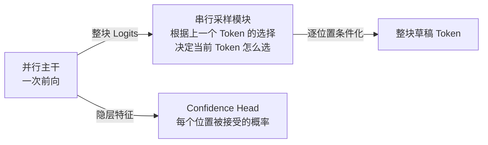
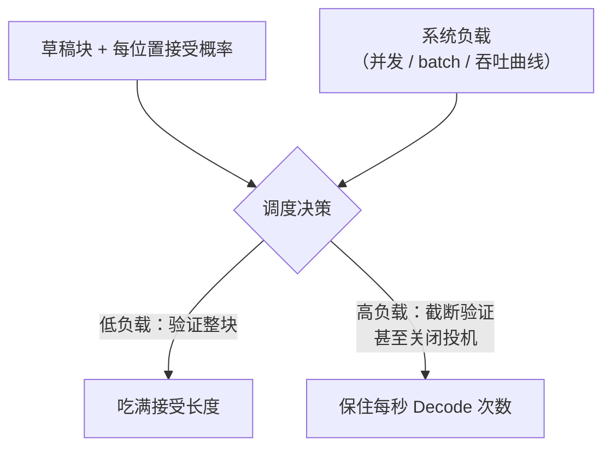

前四节的方法，无论树状（EAGLE-3）、线性（MTP）还是并行块（DFlash），本质都还是"一个更好的草稿模型"。DSpark 往后退了一步，把镜头拉远：**在某种程度上，它更接近一个投机采样加速系统**——它的贡献分两层，模型层面和系统层面，缺一不可。模型层面，它直面 EAGLE-3 与 DFlash 各自的死穴，取两者之长；系统层面，它把"验证多少个草稿 Token"从静态超参变成随负载动态调整的调度决策。这也是 DeepSeek 在生产服务系统（DeepSeek-V4）里真刀真枪跑过的方案，是投机解码从论文走向生产系统的代表性一步。

<!-- more -->

## 📑 目录

- [1. 出发点：EAGLE-3 与 DFlash 的互补](#1-出发点eagle-3-与-dflash-的互补)
- [2. 模型层面：半自回归结构](#2-模型层面半自回归结构)
- [3. 模型层面：Confidence Head](#3-模型层面confidence-head)
- [4. 系统层面：全局吞吐量的权衡](#4-系统层面全局吞吐量的权衡)
- [5. 效果与定位](#5-效果与定位)
- [总结](#-总结)
- [自我检验清单](#-自我检验清单)
- [参考资料](#-参考资料)

---

## 1. 出发点：EAGLE-3 与 DFlash 的互补

把 5.2 和 5.4 两节的结论摆在一起，互补关系一目了然：

| 📊 维度 | EAGLE-3 | DFlash |
|---|---|---|
| 接受率/接受长度 | **高**（特征级草稿 + 树状容错） | 较低（块内无依赖，后缀衰减） |
| 草稿耗时 | **长**（自回归串行执行） | **短**（一次前向整块成型） |
| 结构代价 | 串行延迟随深度累积 | 丢了 Token 间依赖 |

一个"准而慢"，一个"快而糙"。DSpark 的目标因此非常清楚：**用 DFlash 的框架拿速度，把 EAGLE-3 的依赖建模补回来拿接受率**——论文报告其平均接受长度超出 EAGLE-3 约 26%~31%、超出 DFlash 约 16%~18%，两头通吃。

---

## 2. 模型层面：半自回归结构

### 2.1 主体：沿用 DFlash 的并行主干

DSpark 整体采用 DFlash 式的框架：一个轻量的**并行主干**，一次前向输出整块所有位置的 Logits；Base 若干层的 Hidden States 同样经映射后注入草稿的 KV 上下文（5.4 节的核心思想之二原样继承）。所以"块内并行 + Base 特征注入"这两个速度与质量的底座，DSpark 都直接继承。

### 2.2 关键改造：串行的采样模块

分歧发生在拿到整块 Logits 之后。DFlash 对每个位置直接做**简单的贪婪采样**——各选各的 argmax，块内 Token 相互独立；DSpark 则加了一个**专门的采样模块**：

> **每个位置怎么选 Token，取决于上一个位置的选取结果**——采样过程在块内是串行的。

用概率的语言写出来更清楚。纯并行草稿假设块内各位置**独立**：

$$
P(x_1, x_2, \dots, x_k \mid x_0) = \prod_i p_i(x_i \mid x_0)
$$

而 DSpark 恢复了**链式分解**：

$$
P(x_1, x_2, \dots, x_k \mid x_0) = \prod_i p_i(x_i \mid x_0, x_1, \dots, x_{i-1})
$$

每个位置的分布以"前面位置实际选了什么"为条件——5.4 节丢掉的 Token 间依赖，以极轻量的方式（一个低秩的、Token 条件化的修正模块）接了回来。训练时用标准答案做 Teacher Forcing，推理时这个头串行地跑——但因为主干的重活已经并行做完了，串行的只是轻量修正，草稿整体依然是"一次前向 + 一点点串行尾巴"。

🔑 **核心概念**：这就是**半自回归（Semi-Autoregressive）**——**并行主干保速度，串行采样头保依赖**。名字里的"半"字很精确：块与块之间自回归（下一块以上一块被接受的结果为条件），块内主干并行、采样串行。它站在 EAGLE-3（全自回归）和 DFlash（全并行）两个极端中间，兼收两者。

---

## 3. 模型层面：Confidence Head

DSpark 在草稿模型里还内置了一个**专门的 Confidence Head**：对草稿块的每个位置，预测**这个 Token 会被 Base 接受的概率**。

- **训练**：这个标签不需要真的跑一遍验证才能得到——草稿分布与 Base 分布的偏差（两者概率分布的距离）可以直接解析算出接受概率，作为监督信号；
- **校准**：置信度预测普遍会偏乐观，DSpark 在服务时做在线的校准（Temperature Scaling 一类），让"预测的接受概率"贴近"真实的接受概率"。

注意这个头的输出**不参与生成草稿，也不参与验证**——它是给第 4 节的系统调度器看的信号。这是 DSpark 设计哲学的体现：模型不仅负责"猜得准、猜得快"，还要**把"自己猜得到底有多准"告诉系统**，让系统拿着这个信息做调度。

---

## 4. 系统层面：全局吞吐量的权衡

### 4.1 一个乘法：全局吞吐量 = 接受长度 × 每秒 Decode 次数

DSpark 系统层面的核心思想，是围绕一个恒等式做优化：

$$
\text{全局吞吐量} = \text{接受长度} \times \text{每秒 Decode 次数}
$$

单看"接受长度"是不够的——它只是乘法的一头。而两个旋钮**方向相反**：

- **多验证一些草稿 Token** → 每轮可能接受更多（接受长度 ↑），但——
- **每秒 Decode 次数 ↓**：验证的 Token 越多，每次前向越重；更严重的是在 Continuous Batching（2.2 节）的高并发服务里，投机 Token 会**挤占批处理的 Token 预算**——同一批能容纳的请求变少，系统轮转变慢。

⚠️ **注意**：这正是投机解码在**高并发场景**的经典陷阱——低并发时无脑开投机、开长草稿几乎稳赚（Memory Bound 红利独享）；高并发时批次已经吃饱、算术强度已经上来了，"多算几个 Token 免费"的前提不再成立，投机反而可能让全局吞吐**负优化**。所以验证长度不能是静态超参，必须是随系统状态动态调整的决策。

### 4.2 Confidence-Scheduled Verification：动态验证预算

DSpark 的解法是一个专门的调度机制，**动态决定每个请求本轮验证多少个草稿 Token**：

- **Token 侧的信号**：Confidence Head 给出每个草稿 Token 的被接受概率——预测"大概率被接受"的位置，验证它才是划算的买卖；预测"多半会被拒"的位置，验证它就是浪费 batch 容量。按前缀存活概率（连乘）估算，可以在草稿块内动态截断验证长度；
- **系统侧的信号**：当前系统资源情况（并发数、batch 状态、引擎吞吐曲线）——负载轻时多验，负载重时少验甚至不验。

这个机制的精妙之处在于把 2.2 节调度器的老逻辑（token budget、抢占）延伸到了投机解码的维度：**草稿 Token 也是一种要争抢预算的资源**，而 Confidence Head 让系统"看得见"每份预算的期望回报。

---

## 5. 效果与定位

### 5.1 生产效果

DSpark 已部署在 DeepSeek-V4 的服务系统上，用真实用户流量检验。论文报告的关键数字：**与既定的生产基线 MTP-1（5.3 节）相比，在相同吞吐量水平下，单用户生成速度提升 60%~85%**；更重要的是，它防止了严格延迟约束下的吞吐塌方，打开了以前达不到的性能档位。

### 5.2 定位：从算法问题到系统问题

回到本章开头的两条结论，DSpark 给这个系列画上了一个阶段性的句号：

- 5.1：框架（Draft + Verify，无损）
- 5.2 / 5.3：猜得**准**（EAGLE-3 特征级树、MTP 同源头）
- 5.4：猜得**快**（DFlash 块扩散）
- 5.5：**准、快、系统**三者联合优化（半自回归 + confidence 调度）

DSpark 最大的启示不在某个具体结构，而在视角：**投机解码的收益公式里，"接受长度"是模型给的，"每秒 Decode 次数"是系统给的**——只优化分子或只优化分母，都会在另一个上把收益吐回去。算法和系统的联合设计，才是把这条路线推向生产上限的方式。配套开源的 DeepSpec 训练栈（支持 Qwen、Gemma 等模型的草稿训练）也延续了这个"算法 × 系统"的工程化思路。

---

## 📝 总结

- DSpark 分**模型层面**与**系统层面**两层贡献，更像一个投机采样加速系统而不只是一个草稿模型。
- 模型层面：**EAGLE-3 接受率高但草稿耗时、DFlash 草稿快但接受率低**——DSpark 兼取两者。整体沿用 DFlash 的并行主干与 Base 特征注入 KV，但对整块 Logits 不做简单贪婪采样，而是由**专门的串行采样模块根据上一个 Token 的选择决定当前 Token**，恢复块内依赖——即**半自回归**（并行主干 + 串行采样头）。
- 模型层面另有一个 **Confidence Head**：预测每个草稿 Token 被 Base 接受的概率，训练标签可由草稿/目标分布距离解析得出，服务时做在线校准——它不参与生成，是给调度器的信号。
- 系统层面：**全局吞吐量 = 接受长度 × 每秒 Decode 次数**；多验证草稿 Token 抬高前者、压低后者（高并发下挤占 batch 容量的负优化陷阱）。DSpark 用 **Confidence-Scheduled Verification**，按每 Token 接受概率与当前系统资源动态决定验证长度。
- 生产效果：DeepSeek-V4 服务系统部署，相对 MTP-1 基线，相同吞吐下单用户速度 +60%~85%；接受长度超出 EAGLE-3 约 26%~31%、DFlash 约 16%~18%。训练栈 DeepSpec 已开源。

## 🎯 自我检验清单

- 能说清 EAGLE-3 与 DFlash 在接受率/草稿耗时两个维度上的互补关系
- 能写出纯并行草稿与半自回归草稿的概率分解差异，并解释"并行主干 + 串行采样头"各保什么
- 能解释 Confidence Head 训练标签为什么可以解析计算（分布距离 → 接受概率），以及它的输出给谁用
- 能推导"全局吞吐量 = 接受长度 × 每秒 Decode 次数"，并解释两个旋钮为什么方向相反
- 能讲清高并发下投机解码"负优化"的成因（投机 Token 挤占 batch 预算，"多算免费"前提失效）
- 能描述 DSpark 动态验证预算的决策输入（Token 接受概率 + 系统资源），以及它为什么不能是静态超参
- 能概括本章五节的演进逻辑：框架 → 猜得准 → 猜得快 → 准、快、系统联合

## 📚 参考资料

- [DSpark: Confidence-Scheduled Speculative Decoding with Semi-Autoregressive Generation（本节主题论文）](https://arxiv.org/abs/2607.05147)
- [DeepSpec（DeepSeek 开源的投机解码草稿训练栈）](https://github.com/deepseek-ai/DeepSpec)
- [DFlash: Block Diffusion for Flash Speculative Decoding（DSpark 的并行主干来源）](https://arxiv.org/abs/2602.06036)
- [EAGLE-3: Scaling up Inference Acceleration via Training-Time Test（DSpark 的对比基线之一）](https://arxiv.org/abs/2503.01840)
